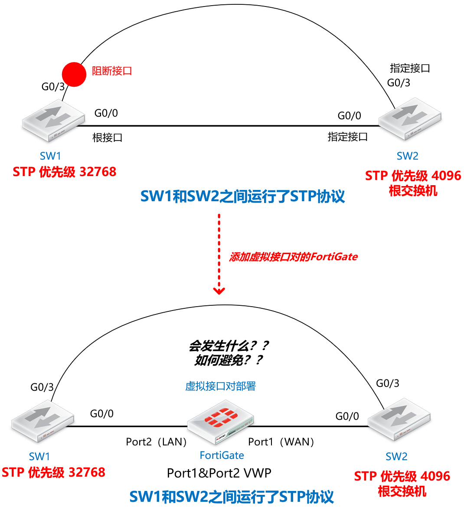
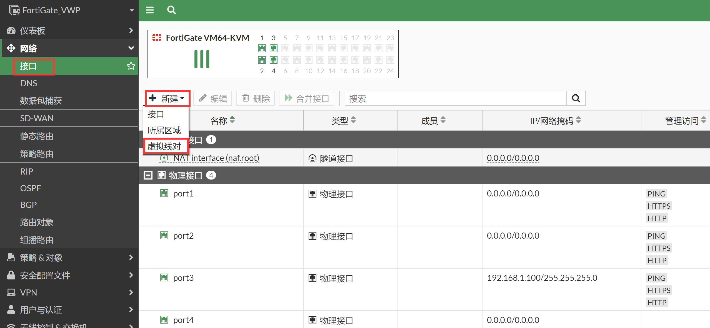
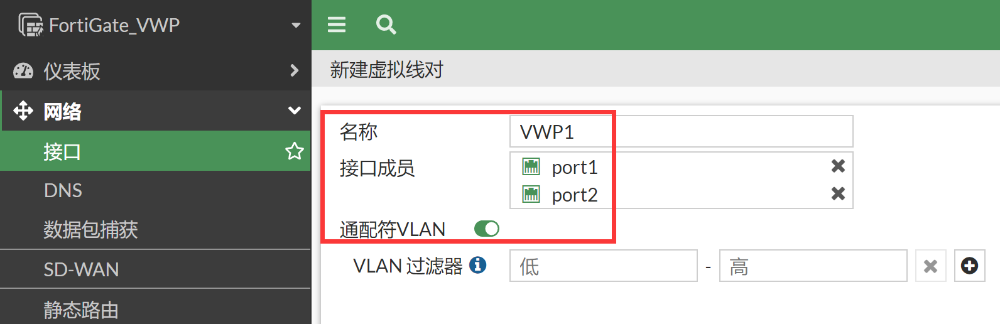

# 生成树(STP)与虚拟接口对

## 组网需求

SW1和SW2之间运行了STP协议，防火墙以虚拟接口对方式运行在两台SW之间，SW和SW之间原本存在环路，通过STP进行隔离阻断了环路接口，在加入虚拟接口对的FGT之后，需要继续确保STP工作正常。

## 网络拓扑



## 配置要点

- Router1/Router2路由器的基础配置

- 将防火墙配置为虚拟接口对并开启网管

- 默认情况下，观察PPPOE拨号的情况

- 配置l2forward解决非IP流量转发问题

## 配置步骤与结果验证

1. SW1/SW2交换机的基础配置和STP状态确认。

   **SW1：**

   ```
   hostname SW1
   spanning-tree vlan 1 priority 32768
   ```

   **SW2：**

   ```
   hostname SW2
   !
   spanning-tree vlan 1 priority 4096
   ```

   **没有加入虚拟接口对的FortiGate之前STP状态：**

   ```
   SW1#show spanning-tree 
   VLAN0001
     Spanning tree enabled protocol rstp
     Root ID    Priority    4097
                Address     5000.0008.0000
                Cost        4
                Port        1 (GigabitEthernet0/0)
                Hello Time   2 sec  Max Age 20 sec  Forward Delay 15 sec
     Bridge ID  Priority    32769  (priority 32768 sys-id-ext 1)
                Address     5000.0007.0000
                Hello Time   2 sec  Max Age 20 sec  Forward Delay 15 sec
                Aging Time  300 sec
   Interface           Role Sts Cost      Prio.Nbr Type
   ------------------- ---- --- --------- -------- --------------------------------
   Gi0/0               Root FWD 4         128.1    Shr
   Gi0/3               Altn BLK 4         128.4    Shr     // G0/3 被阻断，STP工作正常
   
   SW2#show spanning-tree 
   VLAN0001
     Spanning tree enabled protocol rstp
     Root ID    Priority    4097
                Address     5000.0008.0000
                This bridge is the root
                Hello Time   2 sec  Max Age 20 sec  Forward Delay 15 sec
     Bridge ID  Priority    4097   (priority 4096 sys-id-ext 1)
                Address     5000.0008.0000
                Hello Time   2 sec  Max Age 20 sec  Forward Delay 15 sec
                Aging Time  300 sec
   Interface           Role Sts Cost      Prio.Nbr Type
   ------------------- ---- --- --------- -------- --------------------------------
   Gi0/0               Desg FWD 4         128.1    Shr
   Gi0/3               Desg FWD 4         128.4    Shr
   ```

2. 将防火墙的port1和port2配置为虚拟接口对并加入到SW1和SW2之间，防火墙处于路由模式的情况下，直接创建虚拟接口对：将port1和port2加入到虚拟接口对中并开启通配符VLAN，识别VLAN-Tag的数据（推荐开启通配符VLAN）。

   

   

   

3. 虚拟接口对通道正式打通，可以认为port1和port2之间可以透明的传输数据了（需策略放通），对应的命令行如下。

   ```
   config system virtual-wire-pair
       edit "VWP1"
           set member "port1" "port2"
           set wildcard-vlan enable
       next
   end
   ```

4. 加入FGT在没有任何配置的情况下，观察STP的运行情况，一旦FGT加入到SW1和SW2之间，很明显网络中出现了环路，设备操作很卡顿，SW1和SW2基本上不再响应请求，三台设备均出现了异常情况（默认情况下虚拟接口对的FGT只转发ARP报文，因此只需要一个arp报文就会产生广播风暴，引起环路导致设备、业务中断）。

   ```
   FortiGate_VWP # diagnose sniffer packet any "none" 4
   interfaces=[any]
   filters=[none]
   0.814720 port2 in arp who-has 192.168.1.99 tell 192.168.1.100
   0.814733 port1 out arp who-has 192.168.1.99 tell 192.168.1.100
   0.817141 port1 in arp who-has 192.168.1.99 tell 192.168.1.100
   0.817148 port2 out arp who-has 192.168.1.99 tell 192.168.1.100
   0.818761 port1 in arp who-has 192.168.1.99 tell 192.168.1.100
   0.818771 port2 out arp who-has 192.168.1.99 tell 192.168.1.100
   0.819709 port2 in arp who-has 192.168.1.99 tell 192.168.1.100
   0.819720 port1 out arp who-has 192.168.1.99 tell 192.168.1.100
   0.821533 port2 in arp who-has 192.168.1.99 tell 192.168.1.100
   0.821544 port1 out arp who-has 192.168.1.99 tell 192.168.1.100
   0.825484 port1 in arp who-has 192.168.1.99 tell 192.168.1.100
   0.825492 port2 out arp who-has 192.168.1.99 tell 192.168.1.100
   0.827856 port1 in arp who-has 192.168.1.99 tell 192.168.1.100
   0.827866 port2 out arp who-has 192.168.1.99 tell 192.168.1.100
   0.828752 port1 in arp who-has 192.168.1.99 tell 192.168.1.100
   0.828762 port2 out arp who-has 192.168.1.99 tell 192.168.1.100
   0.829235 port2 in arp who-has 192.168.1.99 tell 192.168.1.100
   0.829244 port1 out arp who-has 192.168.1.99 tell 192.168.1.100
   0.831930 port2 in arp who-has 192.168.1.99 tell 192.168.1.100
   0.831947 port1 out arp who-has 192.168.1.99 tell 192.168.1.100
   0.834842 port2 in arp who-has 192.168.1.99 tell 192.168.1.100
   0.834853 port1 out arp who-has 192.168.1.99 tell 192.168.1.100
   0.836686 port2 in arp who-has 192.168.1.99 tell 192.168.1.100
   0.836694 port1 out arp who-has 192.168.1.99 tell 192.168.1.100
   0.838965 port1 in arp who-has 192.168.1.99 tell 192.168.1.100
   0.838972 port2 out arp who-has 192.168.1.99 tell 192.168.1.100
   0.841965 port1 in arp who-has 192.168.1.99 tell 192.168.1.100
   0.841974 port2 out arp who-has 192.168.1.99 tell 192.168.1.100
   0.843858 port2 in arp who-has 192.168.1.99 tell 192.168.1.100
   0.843866 port1 out arp who-has 192.168.1.99 tell 192.168.1.100
   ```

5. SW1/SW2的 STP状态均异常，所有接口都处于转发状态。

   ```
   SW1#show spanning-tree
   VLAN0001
     Spanning tree enabled protocol rstp
     Root ID    Priority    4097
                Address     5000.0008.0000
                Cost        4
                Port        4 (GigabitEthernet0/3)
                Hello Time   2 sec  Max Age 20 sec  Forward Delay 15 sec
     Bridge ID  Priority    32769  (priority 32768 sys-id-ext 1)
                Address     5000.0007.0000
                Hello Time   2 sec  Max Age 20 sec  Forward Delay 15 sec
                Aging Time  300 sec
   Interface           Role Sts Cost      Prio.Nbr Type
   ------------------- ---- --- --------- -------- --------------------------------
   Gi0/0               Desg FWD 4         128.1    Shr
   Gi0/3               Root FWD 4         128.4    Shr     //SW1的两个接口都处于转发状态
   
   SW2#show spanning-tree
   VLAN0001
     Spanning tree enabled protocol rstp
     Root ID    Priority    4097
                Address     5000.0008.0000
                This bridge is the root
                Hello Time   2 sec  Max Age 20 sec  Forward Delay 15 sec
     Bridge ID  Priority    4097   (priority 4096 sys-id-ext 1)
                Address     5000.0008.0000
                Hello Time   2 sec  Max Age 20 sec  Forward Delay 15 sec
                Aging Time  300 sec
   Interface           Role Sts Cost      Prio.Nbr Type
   ------------------- ---- --- --------- -------- --------------------------------
   Gi0/0               Desg FWD 4         128.1    Shr
   Gi0/3               Desg FWD 4         128.4    Shr  //SW2的两个接口都处于转发状态
   ```

6. 在FGT上抓包可以看到STP的BPDU报文没有被转发，而是被默认丢弃，这是引起环路的根本原因。STP BPDU数据默认不会被虚拟接口对的FGT所转发，因此STP计算不正确，会计算不出网络中的环路，从而引起广播风暴。

   ```
   FortiGate_VWP # diagnose sniffer packet any "none" 4
   interfaces=[any]
   filters=[none]
   1.234590 port2 in stp 802.1w, rapid stp, flags [learn, forward], bridge-id 1001.50:00:00:08:00:00.8001
   2.182694 port1 in stp 802.1w, rapid stp, flags [learn, forward], bridge-id 8001.50:00:00:07:00:00.8001
   3.247650 port2 in stp 802.1w, rapid stp, flags [learn, forward], bridge-id 1001.50:00:00:08:00:00.8001
   4.193908 port1 in stp 802.1w, rapid stp, flags [learn, forward], bridge-id 8001.50:00:00:07:00:00.8001
   5.260154 port2 in stp 802.1w, rapid stp, flags [learn, forward], bridge-id 1001.50:00:00:08:00:00.8001
   6.204003 port1 in stp 802.1w, rapid stp, flags [learn, forward], bridge-id 8001.50:00:00:07:00:00.8001
   7.278226 port2 in stp 802.1w, rapid stp, flags [learn, forward], bridge-id 1001.50:00:00:08:00:00.8001
   8.210732 port1 in stp 802.1w, rapid stp, flags [learn, forward], bridge-id 8001.50:00:00:07:00:00.8001
   9.294582 port2 in stp 802.1w, rapid stp, flags [learn, forward], bridge-id 1001.50:00:00:08:00:00.8001
   10.223021 port1 in stp 802.1w, rapid stp, flags [learn, forward], bridge-id 8001.50:00:00:07:00:00.8001
   11.302829 port2 in stp 802.1w, rapid stp, flags [learn, forward], bridge-id 1001.50:00:00:08:00:00.8001
   12.232585 port1 in stp 802.1w, rapid stp, flags [learn, forward], bridge-id 8001.50:00:00:07:00:00.8001
   13.310023 port2 in stp 802.1w, rapid stp, flags [learn, forward], bridge-id 1001.50:00:00:08:00:00.8001
   14.242616 port1 in stp 802.1w, rapid stp, flags [learn, forward], bridge-id 8001.50:00:00:07:00:00.8001
   ```

7. 那么要如何解决此情况呢？在FGT的二层接口下配置set stpforward enable即可！

   ```
   FortiGate_VWP # config system interface
   FortiGate_VWP (interface) # edit port1
   FortiGate_VWP (port1) # set stpforward enable
   
   FortiGate_VWP (port1) # next
   FortiGate_VWP (interface) # edit port2
   FortiGate_VWP (port2) # set stpforward enable
   FortiGate_VWP (port2) # end
   ```

8. 再次抓包查看，此时FGT可以转发STP BPDU报文了。

   ```
   FortiGate_VWP # diagnose sniffer packet any "stp" 4
   interfaces=[any]
   filters=[stp]
   2.070782 port2 in stp 802.1w, rapid stp, flags [learn, forward], bridge-id 1001.50:00:00:08:00:00.8001
   2.070797 port1 out stp 802.1w, rapid stp, flags [learn, forward], bridge-id 1001.50:00:00:08:00:00.8001
   
   4.085338 port2 in stp 802.1w, rapid stp, flags [learn, forward], bridge-id 1001.50:00:00:08:00:00.8001
   4.085355 port1 out stp 802.1w, rapid stp, flags [learn, forward], bridge-id 1001.50:00:00:08:00:00.8001
   
   6.097429 port2 in stp 802.1w, rapid stp, flags [learn, forward], bridge-id 1001.50:00:00:08:00:00.8001
   6.097444 port1 out stp 802.1w, rapid stp, flags [learn, forward], bridge-id 1001.50:00:00:08:00:00.8001
   
   8.107806 port2 in stp 802.1w, rapid stp, flags [learn, forward], bridge-id 1001.50:00:00:08:00:00.8001
   8.107822 port1 out stp 802.1w, rapid stp, flags [learn, forward], bridge-id 1001.50:00:00:08:00:00.8001
   
   10.114977 port2 in stp 802.1w, rapid stp, flags [learn, forward], bridge-id 1001.50:00:00:08:00:00.8001
   10.114993 port1 out stp 802.1w, rapid stp, flags [learn, forward], bridge-id 1001.50:00:00:08:00:00.8001
   
   12.123637 port2 in stp 802.1w, rapid stp, flags [learn, forward], bridge-id 1001.50:00:00:08:00:00.8001
   12.123651 port1 out stp 802.1w, rapid stp, flags [learn, forward], bridge-id 1001.50:00:00:08:00:00.8001
   
   14.131744 port2 in stp 802.1w, rapid stp, flags [learn, forward], bridge-id 1001.50:00:00:08:00:00.8001
   14.131757 port1 out stp 802.1w, rapid stp, flags [learn, forward], bridge-id 1001.50:00:00:08:00:00.8001
   ```

9. 此时再次查看STP的状态，恢复正常选举状态。

   ```
   SW1#show spanning-tree
   VLAN0001
     Spanning tree enabled protocol rstp
     Root ID    Priority    4097
                Address     5000.0008.0000
                Cost        4
                Port        1 (GigabitEthernet0/0)
                Hello Time   2 sec  Max Age 20 sec  Forward Delay 15 sec
     Bridge ID  Priority    32769  (priority 32768 sys-id-ext 1)
                Address     5000.0007.0000
                Hello Time   2 sec  Max Age 20 sec  Forward Delay 15 sec
                Aging Time  300 sec
   Interface           Role Sts Cost      Prio.Nbr Type
   ------------------- ---- --- --------- -------- --------------------------------
   Gi0/0               Root FWD 4         128.1    Shr
   Gi0/3               Altn BLK 4         128.4    Shr    // G0/3 被阻断，STP工作正常
   
   SW2#show spanning-tree
   VLAN0001
     Spanning tree enabled protocol rstp
     Root ID    Priority    4097
                Address     5000.0008.0000
                This bridge is the root
                Hello Time   2 sec  Max Age 20 sec  Forward Delay 15 sec
     Bridge ID  Priority    4097   (priority 4096 sys-id-ext 1)
                Address     5000.0008.0000
                Hello Time   2 sec  Max Age 20 sec  Forward Delay 15 sec
                Aging Time  300 sec
   Interface           Role Sts Cost      Prio.Nbr Type
   ------------------- ---- --- --------- -------- --------------------------------
   Gi0/0               Desg FWD 4         128.1    Shr
   Gi0/3               Desg FWD 4         128.4    Shr
   ```

   > 要特别注意此情况！避免虚拟接口对的FGT一上线引起STP计算异常，引起广播风暴，造成重大业务故障。

