# 组播(OSPF)与虚拟接口对

## 组网需求

路由器1和路由器2之间运行了动态路由协议，防火墙以虚拟接口对的方式运行在两台路由器之间，需要确保两台路由器之间的动态路由协议运行正常，并且数据可通。

## 网络拓扑

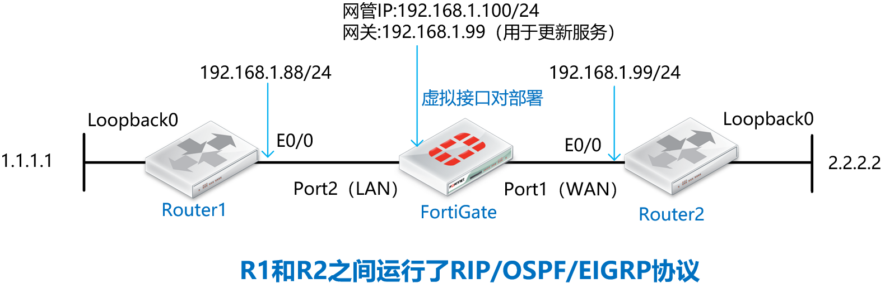

## 配置要点

- Router1/Router2路由器的基础配置

- 将防火墙的port1和port2配置为虚拟接口对

- 默认不配置策略情况下，观察动态路由协议的情况

- 配置安全策略解决OSPF/EIGRP邻居关系异常

## 配置步骤与结果验证

1. Router1/Router2路由器的基础配置。

   Router1：

   ```
   interface Loopback0
   ip address 1.1.1.1 255.255.255.255
   !
   interface Ethernet0/0
   ip address 192.168.1.88 255.255.255.0
   no shutdown
   !
   router ospf 10
   network 1.1.1.1 0.0.0.0 area 0
   network 192.168.1.0 0.0.0.255 area 0
   !
   router rip
   version 2
   network 1.0.0.0
   network 192.168.1.0
   no auto-summary
   !
   router eigrp 10
   network 1.1.1.1 0.0.0.0
   network 192.168.1.0
   ```

   **Router2：**

   ```
   interface Loopback0
   ip address 2.2.2.2 255.255.255.255
   !
   interface Ethernet0/0
   ip address 192.168.1.99 255.255.255.0
   no shutdown
   !
   router ospf 10
   network 2.2.2.2 0.0.0.0 area 0
   network 192.168.1.0 0.0.0.255 area 0
   !
   router rip
   version 2
   network 2.0.0.0
   network 192.168.1.0
   no auto-summary
   !
   router eigrp 10
   network 2.2.2.2 0.0.0.0
   network 192.168.1.0
   ```

2. 将防火墙的port1和port2配置为虚拟接口对，防火墙处于路由模式的情况下，直接创建虚拟接口对，将port1和port2加入到虚拟接口对中并开启通配符VLAN，识别VLAN-Tag的数据（推荐开启通配符VLAN）。

   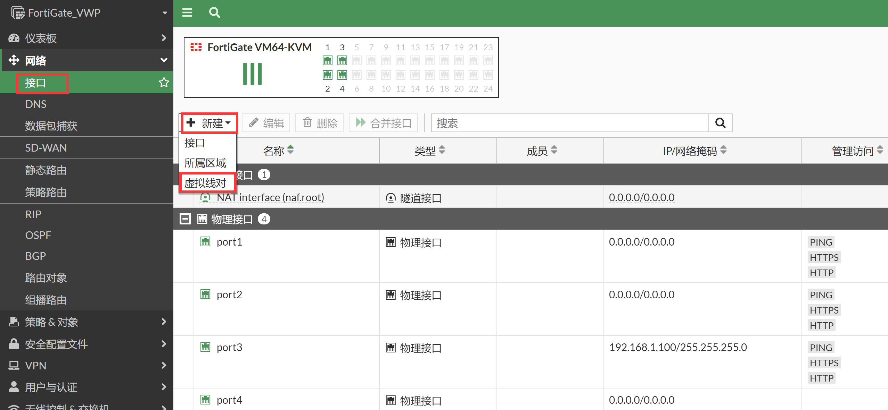

   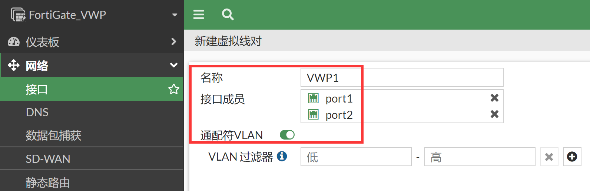

   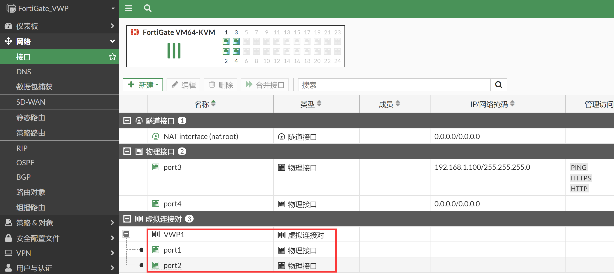

3. 虚拟接口对通道正式打通，可以认为port1和port2之间可以透明的传输数据了（需要防火墙策略放通），对应的CLI如下。

   ```
   config system virtual-wire-pair
       edit "VWP1"
           set member "port1" "port2"
           set wildcard-vlan enable    //这个命令很关键，识别VLAN-TAG，VWP模式下无需再到本地创建对应的VLAN接口和Forwar-Domain了，大大的简化了策略的配置量
       next
   end
   ```

4. 默认不配置任何策略情况下，观察动态路由协议的情况，RIP 邻居是不正常的（无邻居，无路由），OSPF邻居无法建立成功，EIGRP邻居无法建立成功。

   ```
   Router1#show ip rip database
   1.0.0.0/8    auto-summary
   1.1.1.1/32    directly connected, Loopback0
   192.168.1.0/24    auto-summary
   192.168.1.0/24    directly connected, Ethernet0/0
   
   Router1#show ip route    
   ...
   Gateway of last resort is not set
         1.0.0.0/32 is subnetted, 1 subnets
   C        1.1.1.1 is directly connected, Loopback0
         192.168.1.0/24 is variably subnetted, 2 subnets, 2 masks
   C        192.168.1.0/24 is directly connected, Ethernet0/0
   L        192.168.1.88/32 is directly connected, Ethernet0/0
   
   Router1#show ip ospf  neighbor
   
   Router1#show ip eigrp neighbors
   EIGRP-IPv4 Neighbors for AS(10)
   ```

### 原因分析

1. 我们知道RIP/OSPF/EIGRP都是用组播IP来建立邻居关系，同时OSPF和RIGRP也有单播报文的交互：

   ```
   RIP： UDP 520 || 组播 224.0.0.9
   OSPF：IP 89  || 组播 224.0.0.5/224.0.0.6 || 单播 DBD报文使用单独发送
   EIGRP：IP 88 || 组播 224.0.0.10  || 单播 UPDATE报文使用单播传递我们会发现在VWP环境中，RIP/OSPF/EIGRP路由协议统统失败。这和透明模式下的现象是不一样的。
   ```

2. 我们会发现在VWP环境中，RIP/OSPF/EIGRP路由协议统统失败。这和透明模式下的现象是不一样的。

   - 透明模式下：RIP是正常的，OSPF的邻居虽然无法建立但组播交互是正常的，EIRGP的邻居虽然失败但是组播交互也是正常的。
   - VWP模式下：RIP/OSPF/EIGRP都不行，组播单播都无法通信。

3. 我们再VWP模式下抓包查看，邻居交互的组播报文都只有IN，没有OUT，组播报文默认都被丢弃了。这是透明模式的VWP模式最大的一个区别，透明模式下组播默认存在一条any到any允许可以通的组播策略，而VWP实际上是运行在路由模式下的，而路由模式下的组播默认是被隐藏丢弃的。这是二者现象不一样的最关键原因，因此RIP/OSPF/EIGRP三者全挂。

   ```
   FortiGate_VWP # diagnose sniffer packet any "host 192.168.1.88" 4
   interfaces=[any]
   filters=[host 192.168.1.88]
   1501.278671 port2 in 192.168.1.88.520 -> 224.0.0.9.520: udp 24
   1501.278765 port3 in 192.168.1.88.520 -> 224.0.0.9.520: udp 24
   
   1502.138508 port2 in 192.168.1.88 -> 224.0.0.5:  ip-proto-89 56
   1502.138837 port3 in 192.168.1.88 -> 224.0.0.5:  ip-proto-89 56
   
   1511.257832 port2 in 192.168.1.88 -> 224.0.0.10:  ip-proto-88 40
   1511.258000 port3 in 192.168.1.88 -> 224.0.0.10:  ip-proto-88 40
   
   1512.054185 port2 in 192.168.1.88 -> 224.0.0.5:  ip-proto-89 56
   1512.054332 port3 in 192.168.1.88 -> 224.0.0.5:  ip-proto-89 56
   
   1520.487732 port2 in 192.168.1.88 -> 224.0.0.10:  ip-proto-88 40
   1520.487883 port3 in 192.168.1.88 -> 224.0.0.10:  ip-proto-88 40
   
   1527.402323 port2 in 192.168.1.88.520 -> 224.0.0.9.520: udp 24
   1527.402499 port3 in 192.168.1.88.520 -> 224.0.0.9.520: udp 24
   ```

### 解决办法

1. 既然知道问题的原因，那么解决办法就很简单了，只需要放通组播的策略，然后再放通单播的策略即可。

2. 首先在系统管理→可见功能，打开组播策略GUI的显示。

   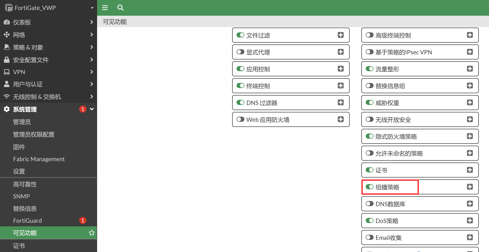

3. 进入策略&对象→组播策略中，可以看到默认的丢弃策略是隐藏的。

   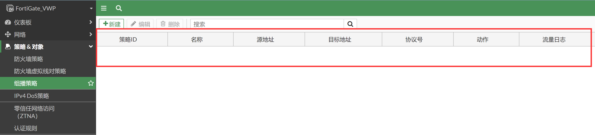

4. 新增组播策略允许路由组播通过。

   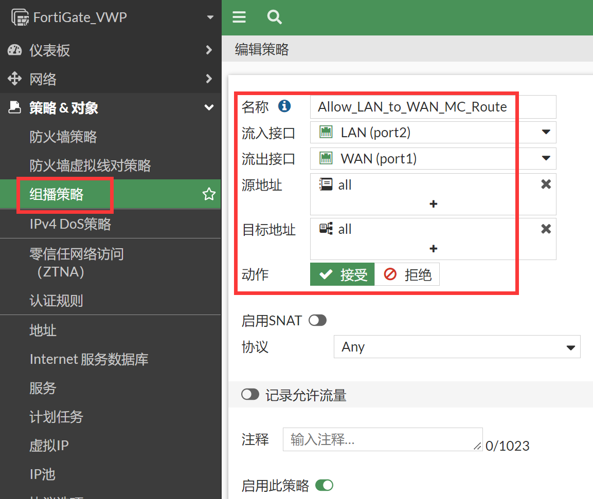

   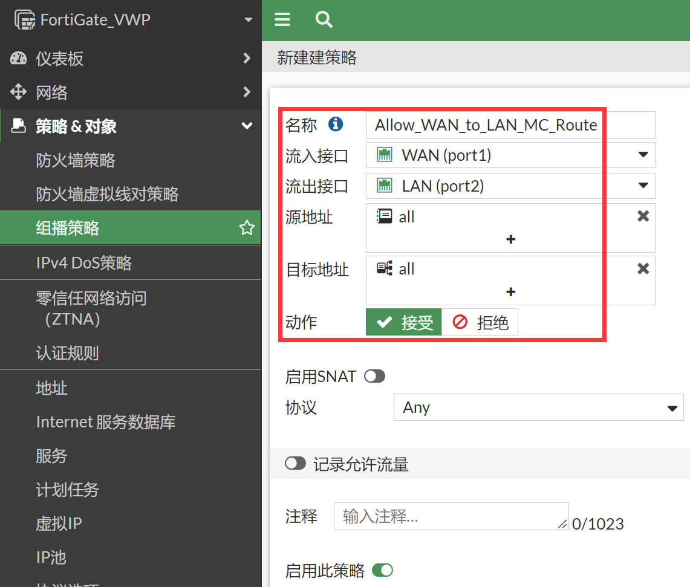

   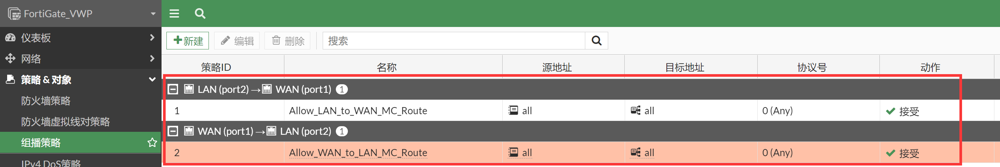

5. 组播策略配置完毕，RIP协议就工作正常了。

   ```
   Router1#show ip rip database
   1.0.0.0/8    auto-summary
   1.1.1.1/32    directly connected, Loopback0
   2.0.0.0/8    auto-summary
   2.2.2.2/32
       [1] via 192.168.1.99, 00:00:01, Ethernet0/0
   192.168.1.0/24    auto-summary
   192.168.1.0/24    directly connected, Ethernet0/0
   
   Router1#show ip route       
   ...
   R        2.2.2.2 [120/1] via 192.168.1.99, 00:00:03, Ethernet0/0
   ...
   ```

6. RIP协议只涉及到组播报文发送，但是OSFP和EIGRP邻居还是失败的，因为OSPF和EIGRP的邻居建立过程中需要单播的通信，我们来看现象。

   ```
   Router1#show ip ospf database
               OSPF Router with ID (1.1.1.1) (Process ID 10)
                   Router Link States (Area 0)
   Link ID         ADV Router      Age         Seq#       Checksum Link count
   1.1.1.1         1.1.1.1         274         0x80000003 0x00F9A5 2
   
   Router1#show ip ospf neighbor
   Neighbor ID     Pri   State           Dead Time   Address         Interface
   2.2.2.2           1   INIT/DROTHER    00:00:37    192.168.1.99    Ethernet0/0
   
   Router1#
   *Jul  2 07:55:15.999: %OSPF-5-ADJCHG: Process 10, Nbr 2.2.2.2 on Ethernet0/0 from EXSTART to DOWN, Neighbor Down: Too many retransmissions
   *Jul  2 07:56:16.002: %OSPF-5-ADJCHG: Process 10, Nbr 2.2.2.2 on Ethernet0/0 from DOWN to DOWN, Neighbor Down: Ignore timer expired
   ```

7. 这就和透明模式的现象完全一致了，进一步分析原因，OSPF和EIGRP的组播其实是正常转发的，但是OSPF和EIGRP建立邻居关系不仅仅只使用了组播，而且还使用单播，默认情况下没有任何策略情况下，单播的数据会被默认丢弃，因此邻居关系异常。OSPF的DB Description报文使用单播，EIGRP的Update报文使用单播。这是OSPF和EIGRP邻居关系还是异常的原因。如下抓包所示，OSPF和EIGRP邻居建立过程中的单播报文被FGT丢弃了。

   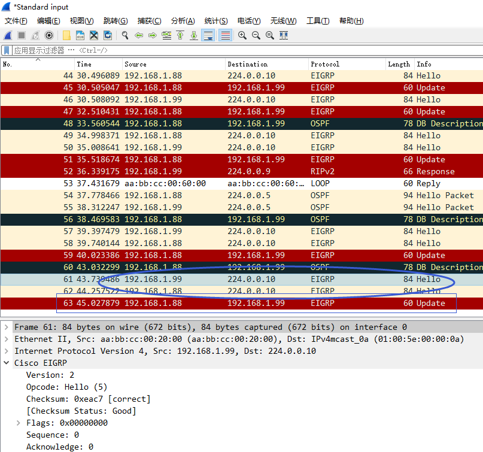

   

   ```
   FortiGate_VWP # diagnose sniffer packet any "host 192.168.1.88" 4
   interfaces=[any]
   filters=[host 192.168.1.88]
   1.720001 port1 in 192.168.1.99 -> 192.168.1.88:  ip-proto-88 20   //EIGRP单播数据只有IN没有OUT，被策略丢弃
   1.747272 port2 in 192.168.1.88 -> 192.168.1.99:  ip-proto-88 20
   
   3.144458 port2 in 192.168.1.88 -> 224.0.0.10:  ip-proto-88 40   //EIGRP组播数据有IN有OUT
   3.144472 port1 out 192.168.1.88 -> 224.0.0.10:  ip-proto-88 40
   
   21.561302 port2 in 192.168.1.88 -> 224.0.0.5:  ip-proto-89 56   //OSPF组播数据有IN有OUT 
   21.561320 port1 out 192.168.1.88 -> 224.0.0.5:  ip-proto-89 56
   
   22.021894 port2 in 192.168.1.88 -> 192.168.1.99:  ip-proto-89 44  //OSPF单播数据只有IN没有OUT，被策略丢弃
   22.023435 port2 in 192.168.1.88 -> 192.168.1.99:  ip-proto-89 60
   ```
   
8. 既然OSPF和EIGRP邻居建立不起来的原因清楚了，那么要解决这个问题就很简单了。只需要增加普通的IPv4单播策略即可。

   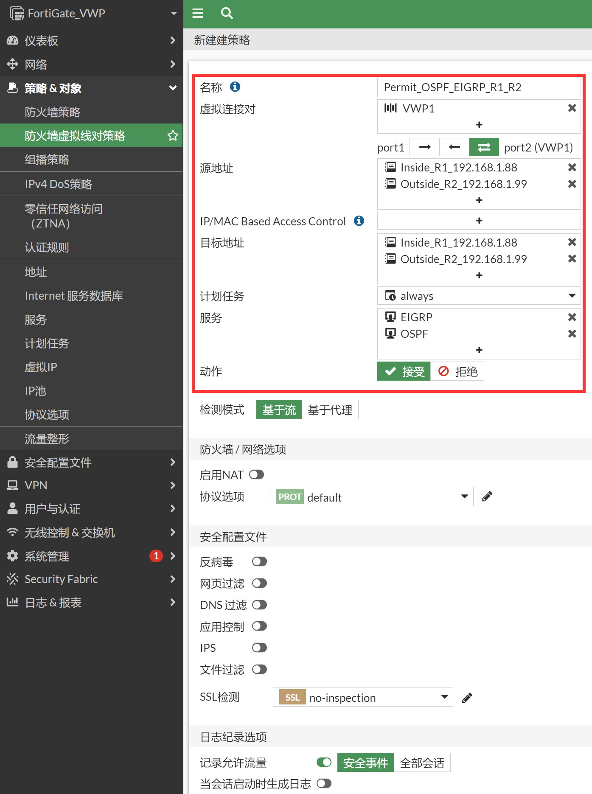

   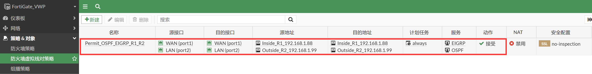

9. 上述策略配置完毕，会发现RIP/OSPF/EIGRP的三者的邻居关系都已经正常建立，路由学习也正常。

   ```
   *Oct 15 09:20:13.561: %DUAL-5-NBRCHANGE: EIGRP-IPv4 10: Neighbor 192.168.1.99 (Ethernet0/0) is up: new adjacency
   *Oct 15 09:20:39.923: %OSPF-5-ADJCHG: Process 10, Nbr 2.2.2.2 on Ethernet0/0 from LOADING to FULL, Loading Done
   Router1#show ip ospf neighbor
   Neighbor ID     Pri   State           Dead Time   Address         Interface
   2.2.2.2           1   FULL/DR         00:00:34    192.168.1.99    Ethernet0/0
   
   Router1#show ip eigrp neighbors
   EIGRP-IPv4 Neighbors for AS(10)
   H   Address                 Interface              Hold Uptime   SRTT   RTO  Q  Seq
                                                      (sec)         (ms)       Cnt Num
   0   192.168.1.99            Et0/0                    13 00:03:06   23   138  0  35
   
   Router1#show ip eigrp topology
   EIGRP-IPv4 Topology Table for AS(10)/ID(1.1.1.1)
   Codes: P - Passive, A - Active, U - Update, Q - Query, R - Reply,
          r - reply Status, s - sia Status
   P 192.168.1.0/24, 1 successors, FD is 281600
           via Connected, Ethernet0/0
   P 2.2.2.2/32, 1 successors, FD is 409600
           via 192.168.1.99 (409600/128256), Ethernet0/0
   P 1.1.1.1/32, 1 successors, FD is 128256
           via Connected, Loopback0
   
   Router1#show ip ospf database
               OSPF Router with ID (1.1.1.1) (Process ID 10)
                   Router Link States (Area 0)
   Link ID         ADV Router      Age         Seq#       Checksum Link count
   1.1.1.1         1.1.1.1         252         0x80000005 0x0098DF 2
   2.2.2.2         2.2.2.2         253         0x80000005 0x008DD3 2
                   Net Link States (Area 0)
   Link ID         ADV Router      Age         Seq#       Checksum
   192.168.1.99    2.2.2.2         253         0x80000001 0x003B1D
   
   Router1#show ip rip database
   1.0.0.0/8    auto-summary
   1.1.1.1/32    directly connected, Loopback0
   192.168.1.0/24    auto-summary
   192.168.1.0/24    directly connected, Ethernet0/0
   
   Router1#show ip route          
   ...
   D        2.2.2.2 [90/409600] via 192.168.1.99, 00:02:51, Ethernet0/0
   ...
   ```

10. 需要配置业务策略允许Router1的1.1.1.1访问Router2的2.2.2.2，没配置策略之前是不通的。

    ```
    Router1#ping 2.2.2.2 source  1.1.1.1  
    Type escape sequence to abort.
    Sending 5, 100-byte ICMP Echos to 2.2.2.2, timeout is 2 seconds:
    Packet sent with a source address of 1.1.1.1
    .....
    Success rate is 0 percent (0/5)
    ```

11. 配置VWP策略允许 Router1的1.1.1.1访问Router2的2.2.2.2。

    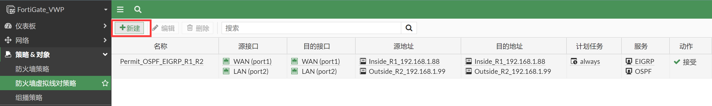

    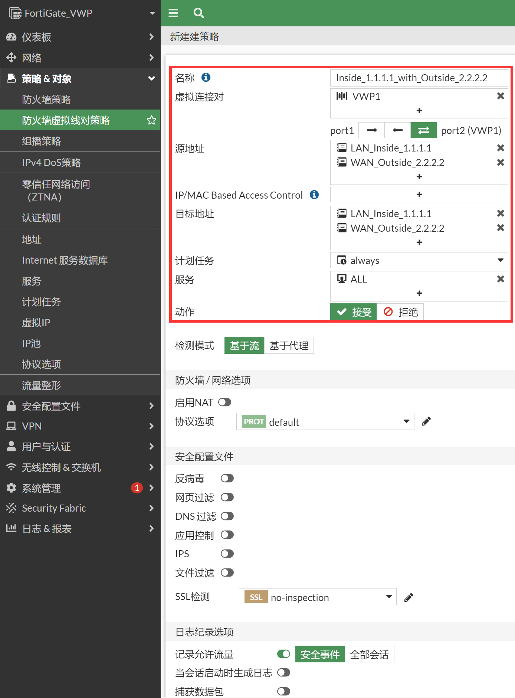

    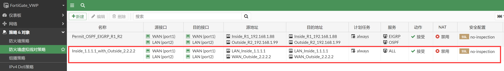

12. 测试Router1的1.1.1.1访问Router2的2.2.2.2，可以正常访问。

    ```
    Router1#ping 2.2.2.2 source  1.1.1.1 repeat 100
    Type escape sequence to abort.
    Sending 100, 100-byte ICMP Echos to 2.2.2.2, timeout is 2 seconds:
    Packet sent with a source address of 1.1.1.1
    !!!!!!!!!!!!!!!!!!!!!!!!!!!!!!!!!!!!!!!!!!!!!!!!!!!!!!!!!!!!!!!!!!!!!!
    !!!!!!!!!!!!!!!!!!!!!!!!!!!!!!
    Success rate is 100 percent (100/100), round-trip min/avg/max = 1/1/9 ms
    ```

    ```
    FortiGate_VWP # diagnose sniffer packet any "icmp" 4
    interfaces=[any]
    filters=[icmp]
    5.551382 port2 in 1.1.1.1 -> 2.2.2.2: icmp: echo request
    5.551455 port1 out 1.1.1.1 -> 2.2.2.2: icmp: echo request
    5.552281 port1 in 2.2.2.2 -> 1.1.1.1: icmp: echo reply
    5.552292 port2 out 2.2.2.2 -> 1.1.1.1: icmp: echo reply
    ```
