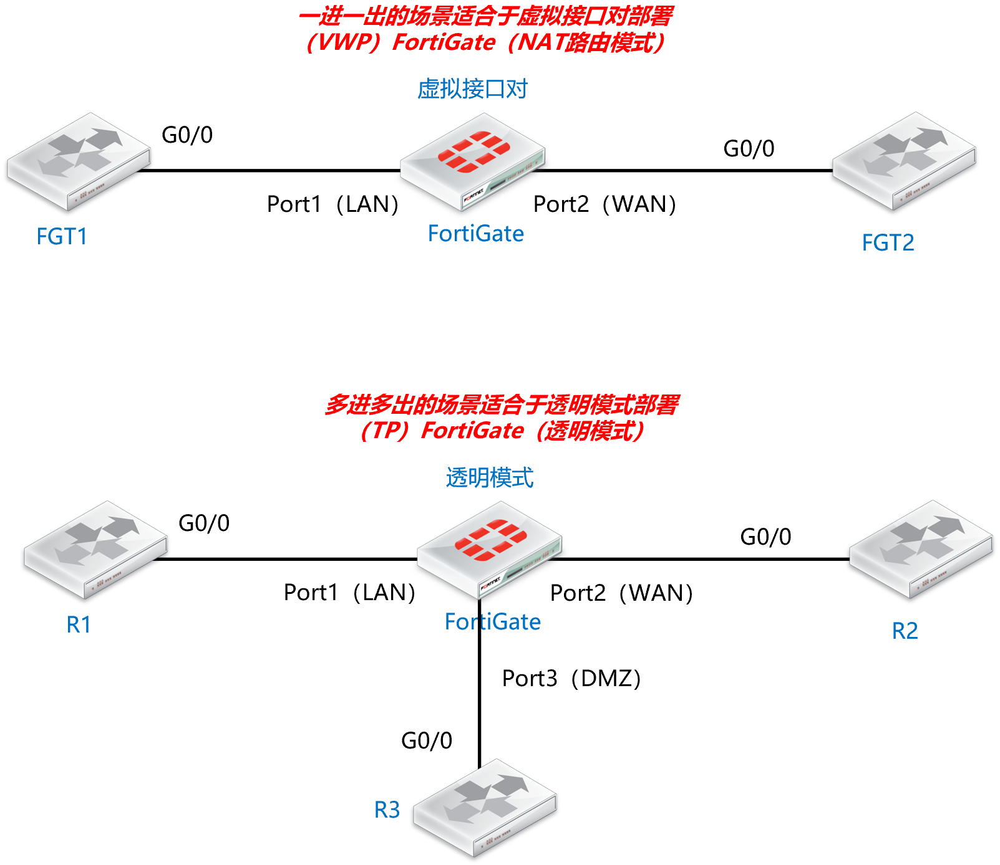

# 虚拟接口对介绍

## 简介

“Virtual Wire Pair”（虚拟接口对）功能提供了一种简便且灵活的类似于FortiGate透明模式的部署方式，“虚拟接口对”顾名思义包括了两个接口（一对接口，无IP地址），流量从一个接口进只能从另外一个接口出，无需查询二层表项，同时通过“虚拟接口对”转发的流量会走NP芯片进行offload，具备很高的转发性能，当然转发流量是否通过最终还是由FortiGate的策略来控制的。由于“虚拟接口对”无需任何IP地址，因此“虚拟接口对”可以方便的插入现有网络中进行部署，和传统的FortiGate透明部署一样不需要改变现有组网的任何配置。

## 优势

- VWP是直接运行在路由模式下的，FGT无需切换到透明模式，无需配置IP地址，使用起来简单方便。
- 从一个接口进一定从另一个接口出，无需查询MAC表项，有更高的转发效率。
- 存在多VLAN的情况下，无需配置VLAN接口，无需配置Forward-Domain，无需配置更多的策略，VWP对于VLAN业务处理的设计和配置要比传统透明模式简洁很多。
- 一些简单的透明场景VWP更加合适，整个VWP的设计就是如此，部署起来比传统透明模式要简单很多。

## 劣势

只能一进一出两个接口部署，不能支持多接口的复杂透明模式场景，多进多出的透明部署场景需要使用到传统的透明模式部署。

## 总结

一进一出的透明模式场景，强烈推荐使用虚拟接口对部署（VWP），又简单又好用。
