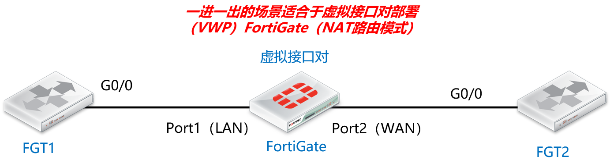

# 虚拟接口对最佳配置实践

## 组网需求

------

一进一出的这样的透明需求的组网推荐使用虚拟接口对（virtual-wire-pair）。

## 网络拓扑

------



## 推荐配置

------

1. 无论网络中是否存在VLAN都推荐开启 wildcard-vlan （set wildcard-vlan enable），让FGT可以识别VLAN-TAG的数据，然后使用策略控制所有的携带和不携带VLAN-TAG的数据流。

2. 开启了wildcard-vlan enable，vlanforward不生效，wildcard-vlan优先，识别VLAN-TAG，并上送到FGT的CPU上去策略处理。这是推荐的配置。（推荐）

3. 如果关闭了wildcard-vlan disable，则vlanforward生效，则携带了vlan-tag的数据会直接穿透VWP接口，不再匹配策略，直接bypass可通。（不推荐这样使用，流量不可见也不可控，这不是安全设备想要的结果）。

   ```
   config system virtual-wire-pair
       edit "VWP1"
           set member "port1" "port2"
           set wildcard-vlan enbale  //手工开启wildcard
       next
   end
   
   config system interface
       edit "port1"
           set vdom "root"
           set vlanforward enable   //保持默认enable状态
           set type physical
           set alias "WAN"
           set snmp-index 1
       next
       edit "port2"
           set vdom "root"
           set vlanforward enable  //保持默认enable状态
           set type physical
           set alias "LAN"
           set snmp-index 2
       next
   end
   ```

4. 虚拟接口对的FortiGate其实默认只转发ARP广播和组播报文，其他的流量通通会被丢弃。如果你想让虚拟接口对更像一个SW一样的存在，那么在使用的接口下应该这样去修改，这样FortiGate对接入的网络环境影响应该来说是更小的，对于那种不是很清楚网络中有一些什么流量的环境，建议按照上述建议进行配置优化，让FortiGate更加接近于一个SW的存在。

   ```
   config system interface
       edit "port1"
           set broadcast-forward enable   //开启广播转发
           set l2forward enable          //开启非IP流量转发
           set stpforward enable        //开启STP转发
       next
       edit "port2"
           set broadcast-forward enable
           set l2forward enable
           set stpforward enable
       next 
   end
   ```

5. 使用一个独立的的VDOM用来保护二层（虚拟接口对）的业务流量，然后再使用一个独立管理VDOM（NAT路由模式）用于设备的管理和fortiguard升级等，利用VDOM功能将管理（NAT路由模式）和业务（虚拟接口对）分离。

## 故障排错

------

1. 先检查FortiGate的二层MAC地址表，下面的命令能导出每一个虚拟接口对的二层转发表，在转发表里可以单独看到HOST与接口的对应MAC地址关系。

   ```
   FortiGate_VWP # diag netlink brctl list
   list bridge information
   1. VWP1_v.b         fdb: size=2048 used=2    num=2    depth=1  
   Total 1 bridges
   diag netlink brctl name host <VWP_name_v>.b
   
   虚拟接口对名字VWP1的查看二层转发表的例子：
   FortiGate_VWP # diag netlink brctl name host VWP1_v.b
   show bridge control interface VWP1_v.b host.
   fdb: size=2048, used=2, num=2, depth=1
   Bridge VWP1_v.b host table
   port no device  devname mac addr                ttl     attributes
     2     4       port2   50:00:00:03:00:01       0       Local Static
     1     3       port1   50:00:00:03:00:00       0       Local Static
   ```

2. 使用sniffer验证数据包是否到达防火墙，通过以下命令使用sniffer抓取相应信息；通过使用ping在FortiGate两端进行测试可以初步分析问题。这个能看到在FortiGate上面流入以及流出的数据包。

   ```
   进行抓取目的地址是114.114.119.119的数据：
   diagnose sniffer packet any "host 114.114.119.119" 4 0 l           按CTRL+C进行停止
   
   基于端口进行数所包抓取
   diagnose sniffer packet portA  "host 114.114.119.119" 4 0  l
   diagnose sniffer packet portB  "host 114.114.119.119" 4 0  l
   
   如有需要，可以通过每个vlan进行获取更明细内容
   diagnose sniffer packet <each_vlan_interface> "" 6 0 l
   
   参数4和6的区别（用于显示输出抓取数据参数）：
   1: print header of packets (只有IP头部)
   2: print header and data from ip of packets (有ip头部和数据内容)
   3: print header and data from ethernet of packets  (if available)
   4: print header of packets with interface name (只有IP头部和端口)
   5: print header and data from ip of packets with interface name (有ip头部和数据内容以及端口)
   6: print header and data from ethernet of packets (if available) with intf name
   
   参数0的用处：输出个数
   
   参数l的用处(用于输出时候显示的时间格式)：
   a：absolute UTC time, yyyy-mm-dd hh:mm:ss.ms
   l：absolute LOCAL time, yyyy-mm-dd hh:mm:ss.ms
   ```

3. 使用debug flow验证数据包是否穿越防火墙（vlanforward无效），在每一个VDOM使用"debug flow"命令进行跟踪流量，通过使用ping在FortiGate两端进行测试可以初步分析问题。这种排障的方法能够查看到流量是否因为某条策略导致数据包不通或者通过设备。

   ```
   以源地址为抓取条件
   ==================================================================
   diag debug flow filter add <IP_address_of_source_device>
   diag debug flow show function-name enable
   diag debug flow show console enable
   diag debug flow show iprope enable
   diag debug flow trace start 100
   diag debug enable
   ==================================================================
   如需要停止，可以敲"diag debug flow trace stop"
   
   以目标地址为抓取条件
   ==================================================================
   diag debug flow filter add <IP_address_of_destination_device>
   diag debug flow show function-name enable
   diag debug flow show console enable
   diag debug flow show iprope enable
   diag debug flow trace start 100
   diag debug enable
   ==================================================================
   如需要停止，可以敲"diag debug flow trace stop"
   
   当有触发排障的流,输出如下：
   id=20085 trace_id=113 msg="vd-tp_mode received a packet(proto=6,10.160.0.160:4370->10.160.0.152:23) from internal."
   id=20085 trace_id=113 msg="Find an existing session, id-00000a40, original direction"
   id=20085 trace_id=113 msg="enter fast path"
   id=20085 trace_id=113 msg="send out via dev-dmz1, dst-mac-00:01:02:03:04:05"
   ```

4. 查看数据包在防火墙上创建的session。在每一个VDOM使用"diag sys session"命令进行防火墙会话检查，通过使用ping在FortiGate两端进行测试可以初步分析问题，这种排障的方法能够查看防火墙是否会为流量创建会话，以及是否硬件加速以及命中哪一条策略。

   ```
   以源地址为抓取条件（单播）
   ==================================================================
   diag sys session filter src <IP_address_of_source_device>
   diag sys session list
   ==================================================================
   当有触发排障的会话,输出如下：
   session info: proto=1 proto_state=00 duration=2 expire=58 timeout=0 flags=00000000 sockflag=00000000 sockport=0 av_idx=0 use=4
   origin-shaper=
   reply-shaper=
   per_ip_shaper=
   class_id=0 ha_id=0 policy_dir=0 tunnel=/ vlan_cos=0/0
   state=may_dirty br
   statistic(bytes/packets/allow_err): org=500/5/1 reply=500/5/1 tuples=2
   tx speed(Bps/kbps): 248/1 rx speed(Bps/kbps): 248/1
   orgin->sink: org pre->post, reply pre->post dev=9->10/10->9 gwy=0.0.0.0/0.0.0.0
   hook=pre dir=org act=noop 192.168.1.1:64->192.168.2.1:8(0.0.0.0:0)
   hook=post dir=reply act=noop 192.168.2.1:64->192.168.1.1:0(0.0.0.0:0)
   misc=0 policy_id=4 auth_info=0 chk_client_info=0 vd=1
   serial=00000512 tos=ff/ff app_list=0 app=0 url_cat=0
   rpdb_link_id = 00000000
   vlanid=100 dd_type=0 dd_mode=0
   total session 1
   
   以源地址为抓取条件（多播）
   ==================================================================
   diagnose sys mcast-session list
   ==================================================================
   当有触发排障的会话,输出如下：
   session info: id=123 vf=1 proto=112 192.168.1.2.0->224.0.0.18.0
   used=2 path=1 duration=1353 expire=179 indev=10 pkts=1360 bytes=54400
   state=00000002:tp
   path: policy=0, outdev=9
   
   session info: id=124 vf=1 proto=112 192.168.2.99.0->224.0.0.18.0
   used=2 path=1 duration=1353 expire=179 indev=10 pkts=1360 bytes=54400
   state=00000002:tp
   path: policy=0, outdev=9
   Total 2 sessions
   diag sys session list
   ```

## 参考文档

------

https://community.fortinet.com/t5/FortiGate/Technical-Tip-Troubleshoot-and-verify-if-traffic-is-hitting-a/ta-p/197261

https://community.fortinet.com/t5/FortiGate/Troubleshooting-Tip-First-steps-to-troubleshoot-connectivity/ta-p/192560

https://community.fortinet.com/t5/FortiGate/Troubleshooting-Tip-FortiGate-session-table-information/ta-p/196988

https://community.fortinet.com/t5/FortiGate/Technical-Tip-Configuring-a-FortiGate-in-Transparent-mode-to/ta-p/197611

https://community.fortinet.com/t5/FortiGate/Technical-Note-FortiGate-and-Gratuitous-ARP-GARP/ta-p/192962
