# 虚拟接口对的网络管理问题

## 组网需求

------

有一个特别的网管情况：防火墙是运行在路由模式下的，一旦开启了VWP，VWP相当于一个透明的接口对，可以透传流量，但是由于FortiGate本身需要被网管，而一旦网管的流量需要穿过VWP被网管的话，则就会遇到网管不了的情况，因为网管数据穿过VWP访问FortiGate的本机IP，这样会话存在混乱，内核和转发将判断会话存在异常，会该网管的导致数据不通。

## 网络拓扑

------

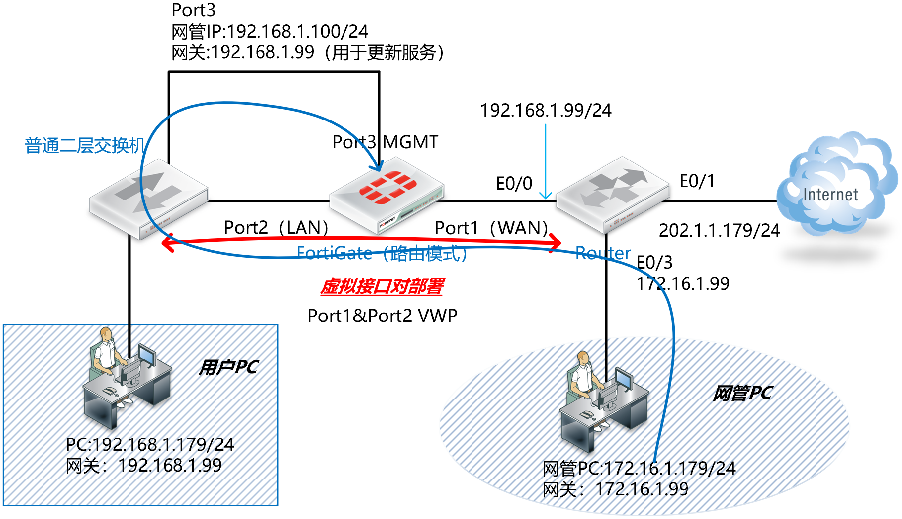

网管区域在WAN侧，而FortiGate的网管接口Port3在LAN侧，这种拓扑环境下网管有两种情况：

- 用户PC可以正常网管FortiGate：用户PC 192.168.1.179 由于和FGT的Port3网管接口同属于LAN侧流量，流量无需穿越VWP，因此可以正常网管（推荐的网管规划和部署）。
- 网管PC无法网管FortiGate：网管PC 172.16.1.99在FortiGate的WAN侧，发起去FGT的Port3网管接口的流量时候，正常流量会穿越VWP然后再达到Port3接口上，由于穿过VWP的时候发现目的IP是Port3，这是一个访问FGT本机的报文，这样FGT在处理管理流量会存在问题。

## 问题复现

------

1. 我们来分析一下上述第二种异常的情况，为测试WAN的网管PC穿越VWP管理FGT，需要新增一条允许WAN 172.16.1.0/24到LAN 192.168.1.0/24的策略。

   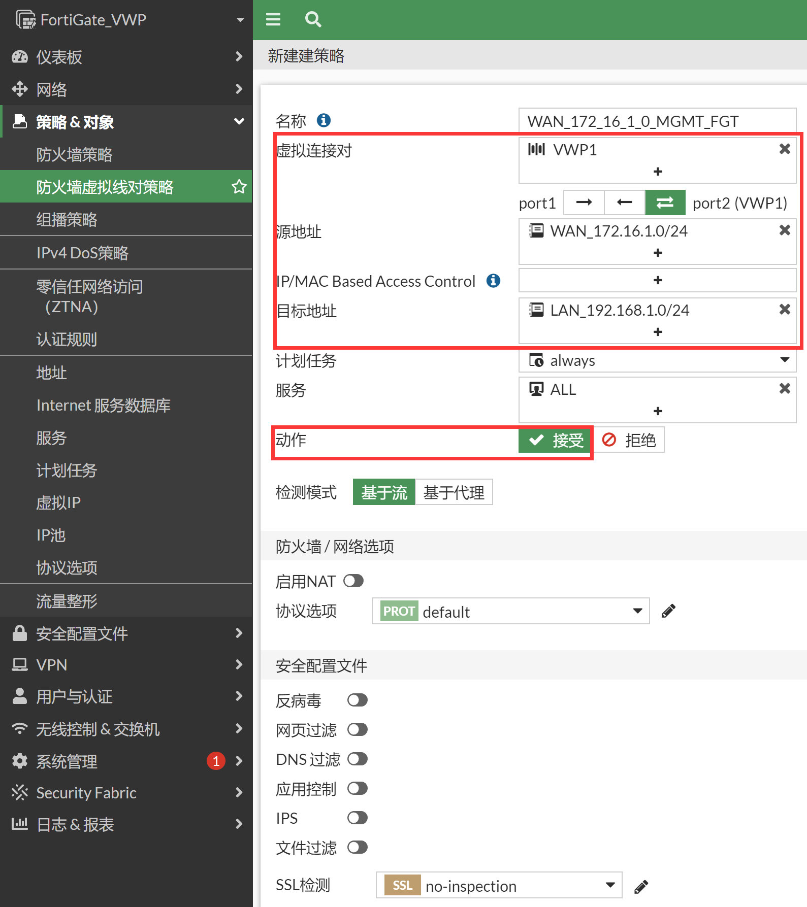

   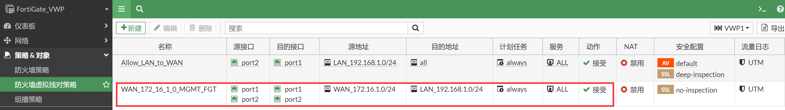

2. 使用网管PC 172.16.1.179访问FortiGate的Port3 192.168.1.100，在FortiGate上抓包查看，网管的数据在Port3接口IN之后就被丢弃了，PING/SSH/HTTPS网管全部失败。

   ```
   FortiGate_VWP # diagnose sniffer packet any "host 172.16.1.179" 4
   interfaces=[any]
   filters=[host 172.16.1.179]
   1.216456 port1 in 172.16.1.179.51524 -> 192.168.1.100.443: syn 3746720489
   1.216496 port2 out 172.16.1.179.51524 -> 192.168.1.100.443: syn 3746720489
   1.259983 port3 in 172.16.1.179.51524 -> 192.168.1.100.443: syn 3746720489
   
   3.241235 port1 in 172.16.1.179 -> 192.168.1.100: icmp: echo request
   3.241320 port2 out 172.16.1.179 -> 192.168.1.100: icmp: echo request
   3.244140 port3 in 172.16.1.179 -> 192.168.1.100: icmp: echo request
   
   26.005468 port1 in 172.16.1.179.51533 -> 192.168.1.100.22: syn 2838383157
   26.005514 port2 out 172.16.1.179.51533 -> 192.168.1.100.22: syn 2838383157
   26.050901 port3 in 172.16.1.179.51533 -> 192.168.1.100.22: syn 2838383157
   ```

3. debug flow查看原因，由于数据从port2 in→port1 out穿越过VWP一次（创建了一个会话），然后又从port3（root）发出一个回复报文，这个回复报文会匹配到之前创建会话，这样的会话接口存在混乱，会引起重放检测失败丢包。

   ```
   diagnose debug flow filter addr 172.16.1.179
   diagnose debug flow show function-name enable
   diagnose debug flow trace start 100
   diagnose debug enable    
   
   id=20085 trace_id=10 func=print_pkt_detail line=5494 msg="vd-root:0 received a packet(proto=6, 172.16.1.179:51565->192.168.1.100:443) from port1. flag [S], seq 1925780389, ack 0, win 8192"
   id=20085 trace_id=10 func=init_ip_session_common line=5654 msg="allocate a new session-000005b1"
   id=20085 trace_id=10 func=br_fw_forward_handler line=539 msg="Allowed by Policy-2:"
   id=20085 trace_id=10 func=__if_queue_push_xmit line=417 msg="send out via dev-port2, dst-mac-50:00:00:03:00:02"
   
   id=20085 trace_id=11 func=print_pkt_detail line=5494 msg="vd-root:0 received a packet(proto=6, 172.16.1.179:51565->192.168.1.100:443) from port3. flag [S], seq 1925780389, ack 0, win 8192"
   id=20085 trace_id=11 func=resolve_ip_tuple_fast line=5569 msg="Find an existing session, id-000005b1, original direction"
   id=20085 trace_id=11 func=vf_ip_route_input_common line=2591 msg="find a route: flag=80000000 gw-192.168.1.100 via root"
   
   id=20085 trace_id=12 func=print_pkt_detail line=5494 msg="vd-root:0 received a packet(proto=6, 192.168.1.100:443->172.16.1.179:51565) from local. flag [S.], seq 2874972251, ack 1925780390, win 14600"
   id=20085 trace_id=12 func=resolve_ip_tuple_fast line=5569 msg="Find an existing session, id-000005b1, reply direction"
   id=20085 trace_id=12 func=ip_session_core_in line=6222 msg="outgoing dev changed:3->5 dir=reply, drop"
   
   id=20085 trace_id=49 func=print_pkt_detail line=5494 msg="vd-root:0 received a packet(proto=1, 172.16.1.179:1->192.168.1.100:2048) from port1. type=8, code=0, id=1, seq=47."
   id=20085 trace_id=49 func=init_ip_session_common line=5654 msg="allocate a new session-000005cc"
   id=20085 trace_id=49 func=br_fw_forward_handler line=539 msg="Allowed by Policy-2:"
   id=20085 trace_id=49 func=__if_queue_push_xmit line=417 msg="send out via dev-port2, dst-mac-50:00:00:03:00:02"
   
   id=20085 trace_id=50 func=print_pkt_detail line=5494 msg="vd-root:0 received a packet(proto=1, 172.16.1.179:1->192.168.1.100:2048) from port3. type=8, code=0, id=1, seq=47."
   id=20085 trace_id=50 func=resolve_ip_tuple_fast line=5569 msg="Find an existing session, id-000005cc, original direction"
   id=20085 trace_id=50 func=vf_ip_route_input_common line=2591 msg="find a route: flag=80000000 gw-192.168.1.100 via root"
   
   id=20085 trace_id=51 func=print_pkt_detail line=5494 msg="vd-root:0 received a packet(proto=1, 192.168.1.100:1->172.16.1.179:0) from local. type=0, code=0, id=1, seq=47."
   id=20085 trace_id=51 func=resolve_ip_tuple_fast line=5569 msg="Find an existing session, id-000005cc, reply direction"
   id=20085 trace_id=51 func=ip_session_core_in line=6222 msg="outgoing dev changed:3->5 dir=reply, drop"
   ```

4. 值得注意的是，FGT（192.168.1.100）是可以主动去ping通172.16.1.179的，也就是说FGT是可以正常的更新Fortiguard服务和上互联网的。

   ```
   FortiGate_VWP # execute ping 172.16.1.179
   PING 172.16.1.179 (172.16.1.179): 56 data bytes
   64 bytes from 172.16.1.179: icmp_seq=0 ttl=127 time=7.8 ms
   64 bytes from 172.16.1.179: icmp_seq=1 ttl=127 time=8.0 ms
   64 bytes from 172.16.1.179: icmp_seq=2 ttl=127 time=7.4 ms
   64 bytes from 172.16.1.179: icmp_seq=3 ttl=127 time=6.0 ms
   64 bytes from 172.16.1.179: icmp_seq=4 ttl=127 time=8.8 ms
   
   FortiGate_VWP # diagnose sniffer packet any "icmp" 4
   interfaces=[any]
   filters=[icmp]
   55.845400 port3 out 192.168.1.100 -> 172.16.1.179: icmp: echo request
   55.848682 port2 in 192.168.1.100 -> 172.16.1.179: icmp: echo request
   55.848706 port1 out 192.168.1.100 -> 172.16.1.179: icmp: echo request
   55.851016 port1 in 172.16.1.179 -> 192.168.1.100: icmp: echo reply
   55.851030 port2 out 172.16.1.179 -> 192.168.1.100: icmp: echo reply
   55.855936 port3 in 172.16.1.179 -> 192.168.1.100: icmp: echo reply
   56.857317 port3 out 192.168.1.100 -> 172.16.1.179: icmp: echo request
   56.863493 port2 in 192.168.1.100 -> 172.16.1.179: icmp: echo request
   56.863515 port1 out 192.168.1.100 -> 172.16.1.179: icmp: echo request
   56.870026 port1 in 172.16.1.179 -> 192.168.1.100: icmp: echo reply
   56.870039 port2 out 172.16.1.179 -> 192.168.1.100: icmp: echo reply
   56.876321 port3 in 172.16.1.179 -> 192.168.1.100: icmp: echo reply
   
   id=20085 trace_id=93 func=print_pkt_detail line=5494 msg="vd-root:0 received a packet(proto=1, 192.168.1.100:2816->172.16.1.179:2048) from local. type=8, code=0, id=2816, seq=0."
   id=20085 trace_id=93 func=init_ip_session_common line=5654 msg="allocate a new session-000013a5"
   
   id=20085 trace_id=94 func=print_pkt_detail line=5494 msg="vd-root:0 received a packet(proto=1, 192.168.1.100:2816->172.16.1.179:2048) from port2. type=8, code=0, id=2816, seq=0."
   id=20085 trace_id=94 func=resolve_ip_tuple_fast line=5569 msg="Find an existing session, id-000013a5, original direction"
   id=20085 trace_id=94 func=br_fw_forward_dirty_handler line=318 msg="Found a reflect session: pro=1, 192.168.1.100/2816=>172.16.1.179/8, dev=4->3"
   id=20085 trace_id=94 func=__if_queue_push_xmit line=417 msg="send out via dev-port1, dst-mac-aa:bb:cc:00:20:00"
   
   id=20085 trace_id=95 func=print_pkt_detail line=5494 msg="vd-root:0 received a packet(proto=1, 172.16.1.179:2816->192.168.1.100:0) from port1. type=0, code=0, id=2816, seq=0."
   id=20085 trace_id=95 func=resolve_ip_tuple_fast line=5569 msg="Find an existing session, id-000013a5, reply direction"
   id=20085 trace_id=95 func=__if_queue_push_xmit line=417 msg="send out via dev-port2, dst-mac-50:00:00:03:00:02"
   
   id=20085 trace_id=96 func=print_pkt_detail line=5494 msg="vd-root:0 received a packet(proto=1, 172.16.1.179:2816->192.168.1.100:0) from port3. type=0, code=0, id=2816, seq=0."
   id=20085 trace_id=96 func=resolve_ip_tuple_fast line=5569 msg="Find an existing session, id-000013a5, reply direction"
   id=20085 trace_id=96 func=vf_ip_route_input_common line=2591 msg="find a route: flag=80000000 gw-192.168.1.100 via root"
   ```

5. 以上就是VWP环境下的网管问题的故障现象，单向通信，跨VWP的网管流量无法正常通信。

## 解决办法

------

1. 从设计上避免这种跨VWP的网管FGT自身的流量，不跨VWP的网管是正常的。

2. 如果无法避免这样的流量，则使用VDOM技术将网管和业务二者独立开来，创建一个管理的VDOM（MGMT）专门用于MGMT，与VWP的所属的VDOM（ROOT）完全独立运行即可，如下图所示。

   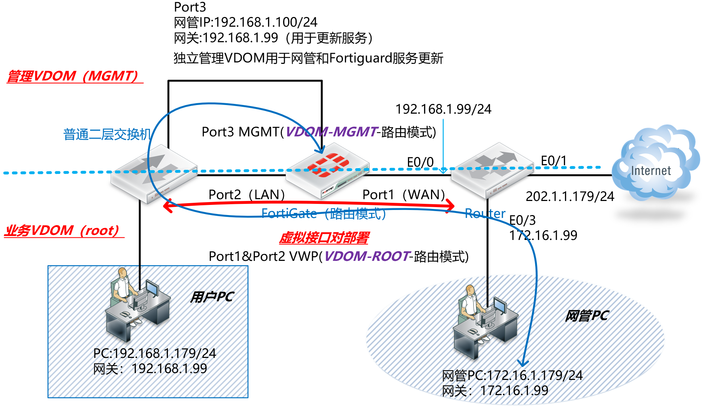

3. 开启FortiGate的VDOM功能。

   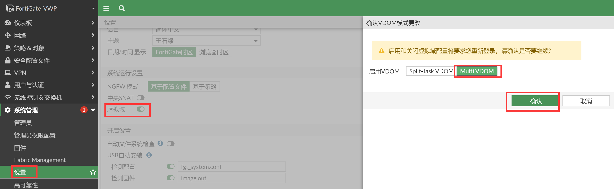

   对应命令行：

   ```
   FortiGate_VWP # config system global
   FortiGate_VWP (global) # set vdom-mode multi-vdom
   FortiGate_VWP (global) # end
   You will be logged out for the operation to take effect
   Do you want to continue? (y/n) y
   exit
   ```

4. 创建MGMT VDOM。

   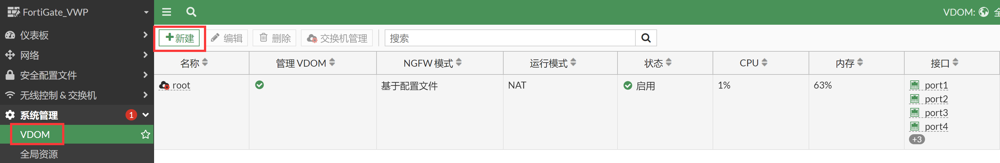

   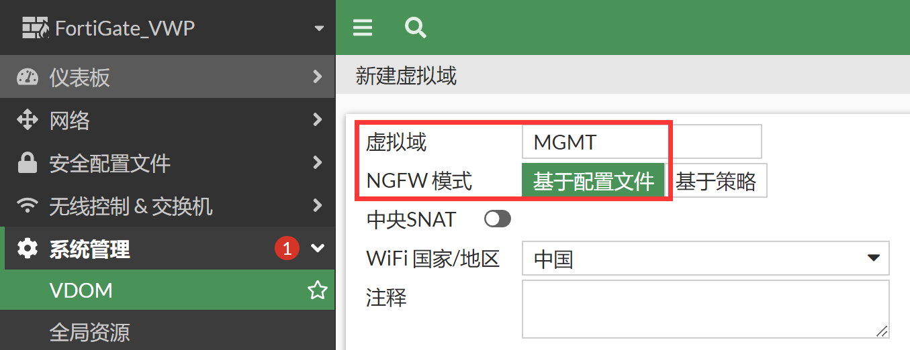

   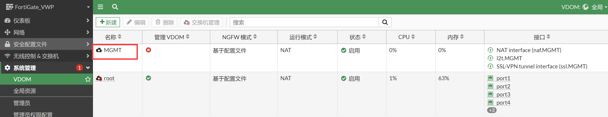

5. 准备将port3加入MGMT VDOM中，将port3加入MGMT VDOM之前需要去掉相关的配置关联项，也就是说port3不能在root下有相关的配置，比如此时有静态路由的配置，则需要删掉该路由。

   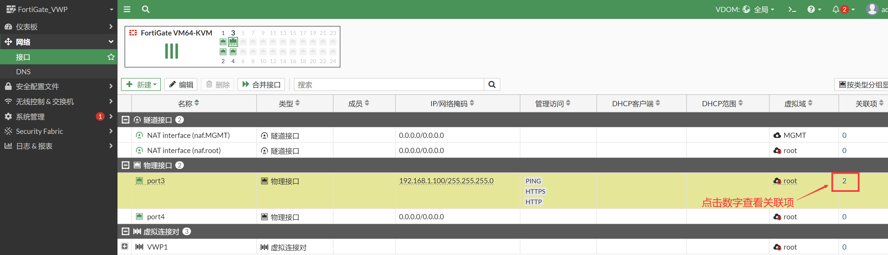

   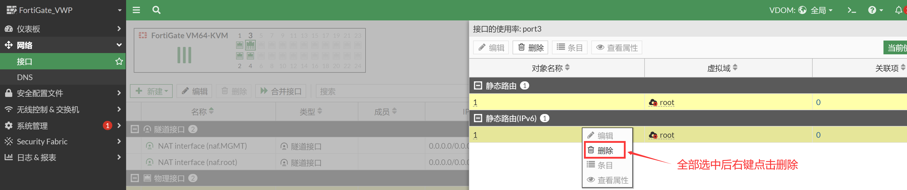

   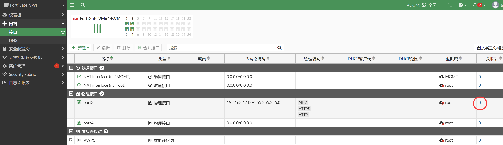

6. 此时可以将port3加入MGMT VDOM。

   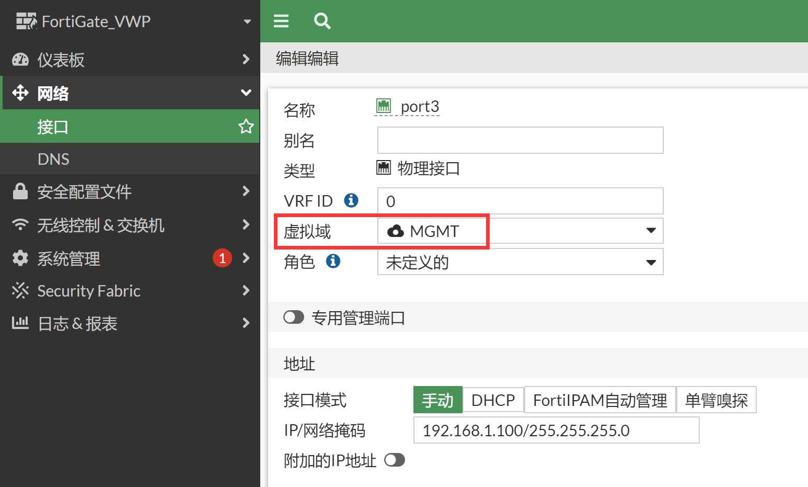

7. 这样相当于port3属于VDOM MGMT，而port1和port2属于 VDOM ROOT，二者完全独立，这样就可以解决会话混乱的问题了。

   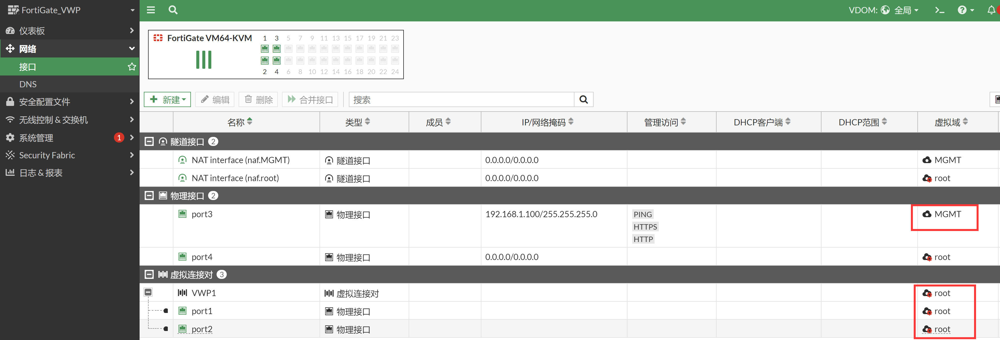

8. 再进入MGMT VDOM，将管理接口的默认路由加上去。

   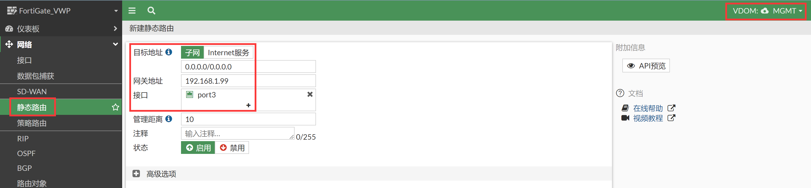

9. 将MGMT VDOM设置为管理VDOM，用于更新Fortiguard（这一项很重要，如果管理VDOM是root则不需要此操作，默认的管理VDOM是root）。

   ```
   FortiGate_VWP # config global
   FortiGate_VWP (global) # config system global
   FortiGate_VWP (global) # set management-vdom MGMT
   FortiGate_VWP (global) # end
   FortiGate_VWP (global) # end
   ```

## 效果验证

------

1. 再次抓取网管PC跨VWP去管理FGT的网管流量。

   ```
   FortiGate_VWP (root) # diagnose sniffer packet any "host 172.16.1.179" 4
   interfaces=[any]
   filters=[host 172.16.1.179]
   6.911052 port1 in 172.16.1.179 -> 192.168.1.100: icmp: echo request
   6.911092 port2 out 172.16.1.179 -> 192.168.1.100: icmp: echo request
   6.914638 port3 in 172.16.1.179 -> 192.168.1.100: icmp: echo request
   6.914682 port3 out 192.168.1.100 -> 172.16.1.179: icmp: echo reply
   6.918603 port2 in 192.168.1.100 -> 172.16.1.179: icmp: echo reply
   6.918621 port1 out 192.168.1.100 -> 172.16.1.179: icmp: echo reply
   
   48.683279 port1 in 172.16.1.179.49159 -> 192.168.1.100.80: syn 3128124765
   48.683385 port2 out 172.16.1.179.49159 -> 192.168.1.100.80: syn 3128124765
   48.684797 port1 in 172.16.1.179.49160 -> 192.168.1.100.80: syn 2745446281
   48.684845 port2 out 172.16.1.179.49160 -> 192.168.1.100.80: syn 2745446281
   48.686611 port1 in 172.16.1.179.49161 -> 192.168.1.100.443: syn 2797650417
   48.686655 port2 out 172.16.1.179.49161 -> 192.168.1.100.443: syn 2797650417
   48.712056 port3 in 172.16.1.179.49159 -> 192.168.1.100.80: syn 3128124765
   48.712230 port3 out 192.168.1.100.80 -> 172.16.1.179.49159: syn 1287655075 ack 3128124766
   48.713907 port3 in 172.16.1.179.49160 -> 192.168.1.100.80: syn 2745446281
   48.713951 port3 out 192.168.1.100.80 -> 172.16.1.179.49160: syn 1003036694 ack 2745446282
   48.715772 port2 in 192.168.1.100.80 -> 172.16.1.179.49159: syn 1287655075 ack 3128124766
   48.715790 port1 out 192.168.1.100.80 -> 172.16.1.179.49159: syn 1287655075 ack 3128124766
   48.717463 port2 in 192.168.1.100.80 -> 172.16.1.179.49160: syn 1003036694 ack 2745446282
   48.717478 port1 out 192.168.1.100.80 -> 172.16.1.179.49160: syn 1003036694 ack 2745446282
   48.717537 port1 in 172.16.1.179.49159 -> 192.168.1.100.80: ack 1287655076
   48.717547 port2 out 172.16.1.179.49159 -> 192.168.1.100.80: ack 1287655076
   48.719277 port1 in 172.16.1.179.49160 -> 192.168.1.100.80: ack 1003036695
   48.719291 port2 out 172.16.1.179.49160 -> 192.168.1.100.80: ack 1003036695 
   
   232.060671 port1 in 172.16.1.179.49158 -> 192.168.1.100.22: syn 446444854
   232.060794 port2 out 172.16.1.179.49158 -> 192.168.1.100.22: syn 446444854
   232.069282 port3 in 172.16.1.179.49158 -> 192.168.1.100.22: syn 446444854
   232.069473 port3 out 192.168.1.100.22 -> 172.16.1.179.49158: syn 1275691481 ack 446444855
   232.072262 port2 in 192.168.1.100.22 -> 172.16.1.179.49158: syn 1275691481 ack 446444855
   232.072278 port1 out 192.168.1.100.22 -> 172.16.1.179.49158: syn 1275691481 ack 446444855
   232.074496 port1 in 172.16.1.179.49158 -> 192.168.1.100.22: ack 1275691482
   232.074512 port2 out 172.16.1.179.49158 -> 192.168.1.100.22: ack 1275691482
   232.084068 port3 in 172.16.1.179.49158 -> 192.168.1.100.22: ack 1275691482
   232.106501 port3 out 192.168.1.100.22 -> 172.16.1.179.49158: psh 1275691482 ack 446444855
   232.111292 port2 in 192.168.1.100.22 -> 172.16.1.179.49158: psh 1275691482 ack 446444855
   232.111311 port1 out 192.168.1.100.22 -> 172.16.1.179.49158: psh 1275691482 ack 446444855
   232.129332 port1 in 172.16.1.179.49158 -> 192.168.1.100.22: psh 446444855 ack 1275691499
   232.129361 port2 out 172.16.1.179.49158 -> 192.168.1.100.22: psh 446444855 ack 1275691499
   232.132511 port3 in 172.16.1.179.49158 -> 192.168.1.100.22: psh 446444855 ack 1275691499
   ```

2. 跨VWP的网管工作正常。

   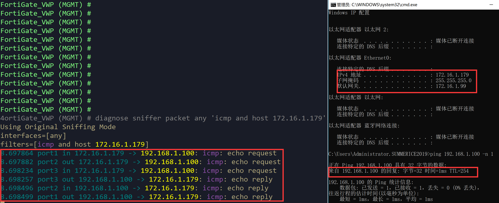

   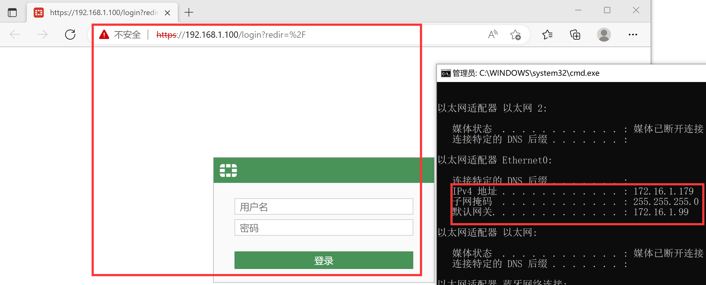

   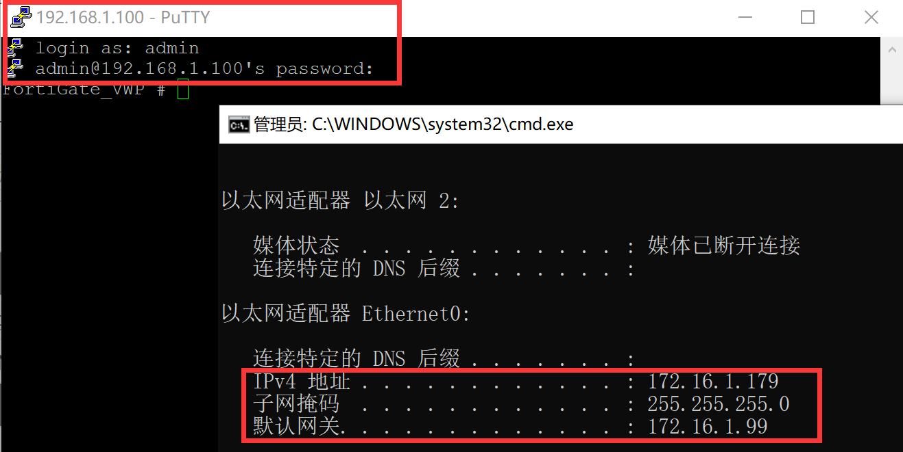

## 总结

------

开启了VWP的FGT网管尽量不要跨VWP进行网管，如果不能避免这样的部署就通过上述所示的VDOM去解决。
