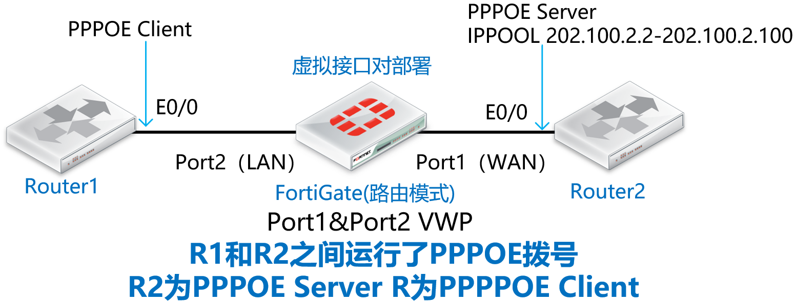
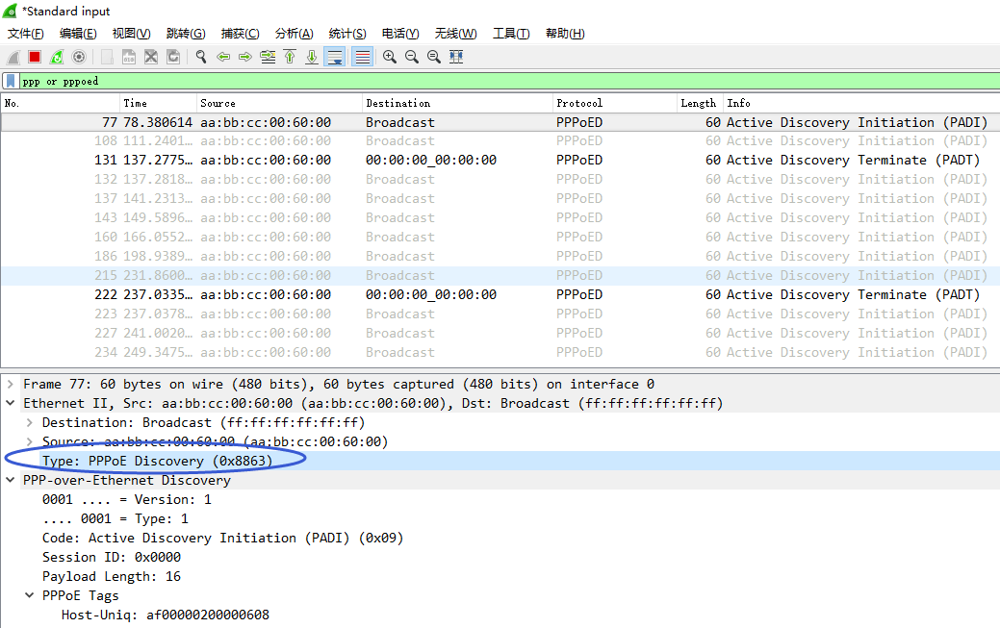
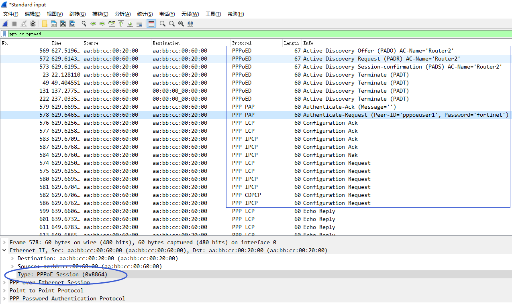

# 非IP流量(PPPOE)与虚拟接口对

## 组网需求

路由器1和路由器2之间运行了PPPOE协议（非IP协议），防火墙以虚拟接口对运行在两台路由器之间，需要确保路由器1的PPPOE拨号正常。

## 网络拓扑



## 配置要点

- Router1/Router2路由器的基础配置

- 将防火墙的port1和port2配置为虚拟接口对

- 默认情况下，观察PPPOE拨号的情况

- 配置l2forward解决非IP流量转发问题

## 配置步骤与结果验证

1. Router1/Router2路由器的基础配置。

   **Router1：**

   ```
   interface Loopback0
   ip address 1.1.1.1 255.255.255.255
   !
   interface Ethernet0/0
   no ip address
   no shutdown
   pppoe enable group global
   pppoe-client dial-pool-number 1
   !
   interface Dialer1
   mtu 1492
   ip address negotiated
   encapsulation ppp
   dialer pool 1
   ppp pap sent-username pppoeuser1 password 0 fortinet
   ppp ipcp route default
   ```

   **Router2：**

   ```
   interface Loopback0
   ip address 2.2.2.2 255.255.255.255
   !
   username pppoeuser1 password 0 fortinet
   !
   bba-group pppoe bba1
   virtual-template 1
   !       
   interface Loopback1
   ip address 202.100.2.1 255.255.255.0
   !
   interface Ethernet0/0
   no ip address
   no shutdown
   pppoe enable group bba1
   !
   interface Virtual-Template1
   description PPPOE bba1
   mtu 1492
   ip unnumbered Loopback1
   peer default ip address pool pool1
   ppp authentication pap
   !
   ip local pool pool1 202.100.2.2 202.100.2.100
   ```

2. 将防火墙的port1和port2配置为虚拟接口对，防火墙处于路由模式的情况下，直接创建虚拟接口对：将port1和port2加入到虚拟接口对中并开启通配符VLAN，识别VLAN-Tag的数据（推荐开启通配符VLAN）。

   

   

   

3. 虚拟接口对通道正式打通，可以认为port1和port2之间可以透明的传输数据了（需策略放通），对应的命令行如下。

   ```
   config system virtual-wire-pair
       edit "VWP1"
           set member "port1" "port2"
           set wildcard-vlan enable
       next
   end
   ```

4. 默认情况下，观察PPPOE拨号的情况，Router1（PPPOE Client）无法PPPPOE拨号成功。

   ```
   Router1#show ip route
   ...
   Gateway of last resort is not set
         1.0.0.0/32 is subnetted, 1 subnets
   C        1.1.1.1 is directly connected, Loopback0
   
   Router1#show ip int brief
   ...
   Dialer1                    unassigned      YES IPCP   up                    up     
   ...
   ```

5. 通过在FGT上抓包可以看到FGT并不转发PPPOE的报文，非IP的PPPOE数据默认不会被FGT所转发。

   ```
   FortiGate_VWP # diagnose sniffer packet any "pppoed" 4
   interfaces=[any]
   filters=[pppoed]
   4.124126 port1 in pppoe printer hasn't been added to sniffer
   37.014209 port1 in pppoe printer hasn't been added to sniffer
   69.908430 port1 in pppoe printer hasn't been added to sniffer
   102.798634 port1 in pppoe printer hasn't been added to sniffer
   135.705063 port1 in pppoe printer hasn't been added to sniffer
   ```

   

6. 那么要如何解决此情况呢？在FGT的虚拟接口对的具体接口下配置set l2forward enable即可！

   ```
   FortiGate_VWP # config system interface
   FortiGate_VWP (interface) # edit port1
   FortiGate_VWP (port1) # set l2forward enable
   
   FortiGate_VWP (port1) # next
   FortiGate_VWP (interface) # edit port2
   FortiGate_VWP (port2) # set l2forward enable
   FortiGate_VWP (port2) # end
   ```

7. 再次抓包查看，此时FGT可以转发PPPOE请求了。

   ```
   FortiGate_VWP # diagnose sniffer packet any "pppoed" 4
   interfaces=[any]
   filters=[pppoed]
   5.324865 port2 in pppoe printer hasn't been added to sniffer
   5.324880 port1 out pppoe printer hasn't been added to sniffer
   5.325468 port1 in pppoe printer hasn't been added to sniffer
   5.325474 port2 out pppoe printer hasn't been added to sniffer
   7.420329 port2 in pppoe printer hasn't been added to sniffer
   7.420342 port1 out pppoe printer hasn't been added to sniffer
   7.425307 port1 in pppoe printer hasn't been added to sniffer
   7.425313 port2 out pppoe printer hasn't been added to sniffer
   ```

   

8. 路由器1 PPPOE拨号成功。

   ```
   Router1#show ppp all      
   Interface/ID OPEN+ Nego* Fail-     Stage    Peer Address    Peer Name
   ------------ --------------------- -------- --------------- --------------------
   Vi2          LCP+ IPCP+ CDPCP-     LocalT   202.100.2.1                    
   
   Router1#show pppoe session
        1 client session
   Uniq ID  PPPoE  RemMAC          Port                    VT  VA         State
              SID  LocMAC                                      VA-st      Type
       N/A      2  aabb.cc00.2000  Et0/0                   Di1 Vi2        UP     
                   aabb.cc00.6000                              UP             
   
   Router1#show ip route    
   ...
   Gateway of last resort is 202.100.2.1 to network 0.0.0.0
   S*    0.0.0.0/0 [1/0] via 202.100.2.1
   ...
   
   Router1#
   Router1#show ip int brief 
   Interface                  IP-Address      OK? Method Status                Protocol
   ... 
   Dialer1                    202.100.2.3     YES IPCP   up                    up     
   ...
   ```
