# OSPF

## 应用场景

1. 若网络中路由设备超过16个，建议使用OSPF，它的路由学习更新速度更快，更适合16个路由设备以上的网络。
2. 当网络路由设备较多，且不超过16个，为避免写大量静态路由，且路由可自动学习，可在FortiGate上配置RIP路由协议功能，让FortiGate也能动态学习到其他网络的路由，  且能自动老化更新。
3. 当网络中路由设备较少，建议使用静态路由即可，维护简单，且对路由器要求不高，因为路由器都支持静态路由，而普通小路由一般不支持RIP协议。

## 组网需求

1. 内网三层交换机和出口FortiGate间通过动态路由OSPF互相通告路由，实现内网用户正常上网。
2. FortiGate手动配置默认路由，并将其重发布引入OSPF，三层交换机与FortiGate之间通过OSPF互相学习路由，实现内网用户正常上网。

## 网络拓扑

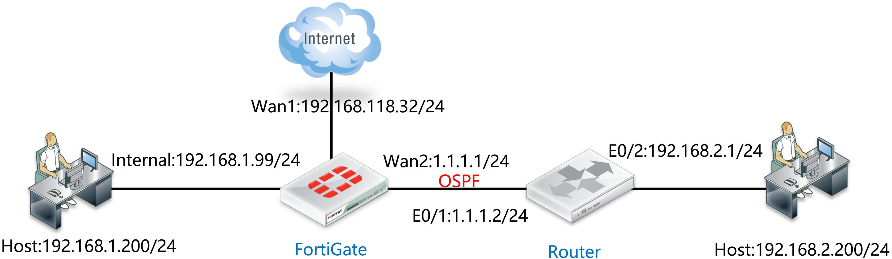

## 配置要点

- 配置接口地址
- 配置默认路由
- 配置OSPF
- 配置路由器ID
- 发布缺省路由
- 重发布
- 建立OSPF区
- 添加OSPF网络
- 添加接口
- 配置对端路由器

## 配置步骤

1. 配置接口地址。

   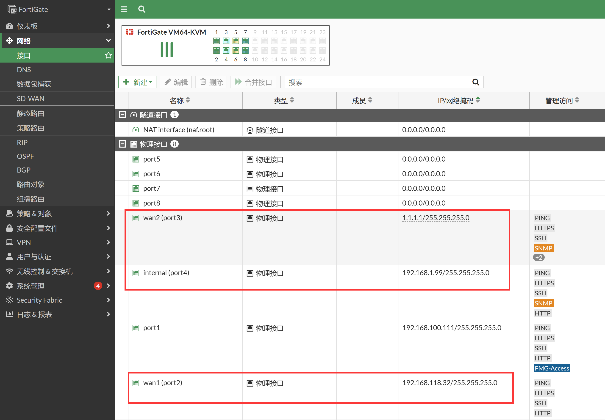

2. 配置默认路由。

   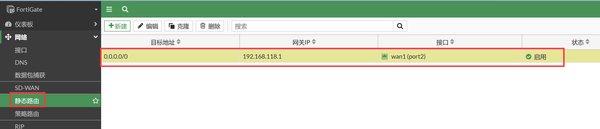

3. 配置OSPF，首先需要在系统配置→可见功能中，开启高级路由功能。

   

4. 进入网络→OSPF页面，配置Router ID。

   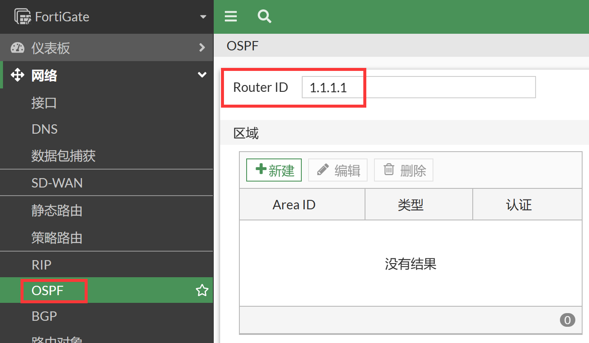

5. 开启默认路由注入，并开启重发布直连路由。

   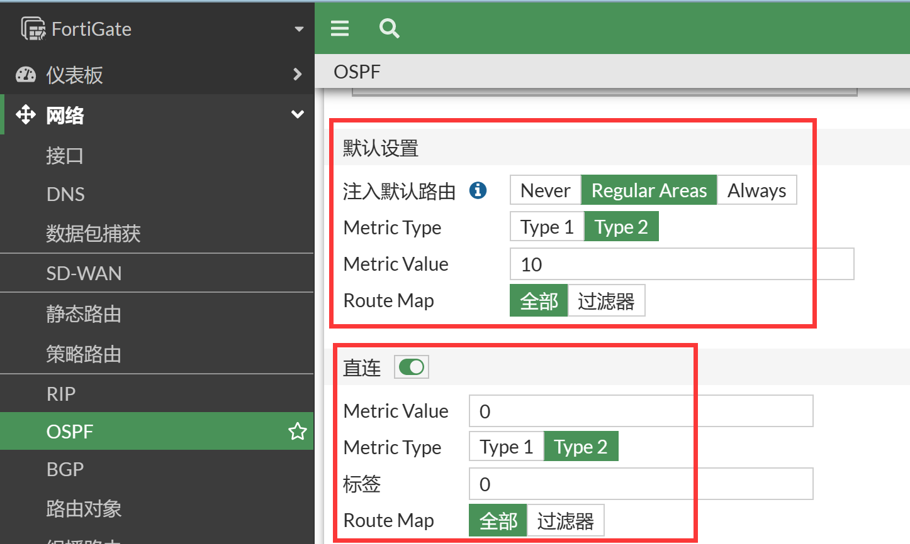

   - 配置Router ID，填写ID为1.1.1.1
   - 注入缺省路由： 选择 "Regular Areas"，其三个选项意义如下：
     - Never： 从不发送缺省路由表
     - Regular Areas： 如果有则发布，没有则不发布
     - Always： 无论是否有缺省路由表，都发布一条缺省路由出去
   - 重发布：勾选 "直连"，将直连的192.168.1.0/24路由信息发送给OSPF邻居

6. 建立OSPF区域，在区域部分点击新建按钮，创建根区域 0.0.0.0（area 0）。

   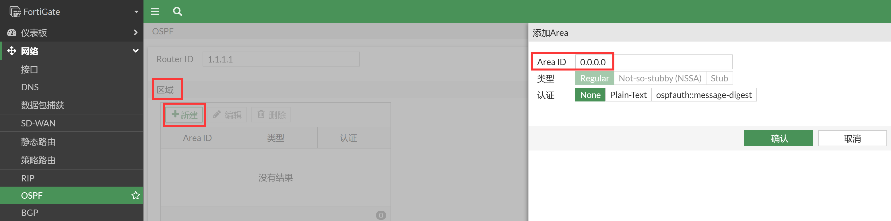

   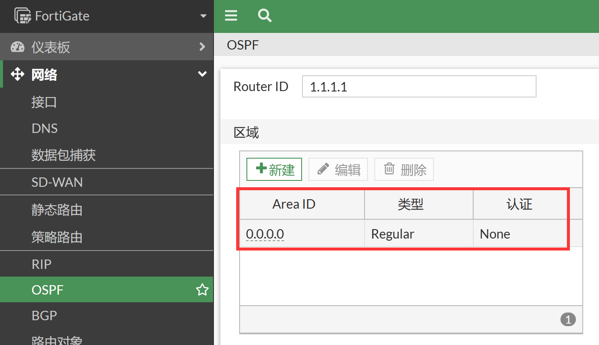

7. 添加OSPF网络，在网络部分点击新建按钮，将1.1.1.0/24和192.168.1.0/24网络加入OSPF区域0.0.0.0，之后点击页面下方的应用按钮应用配置。

   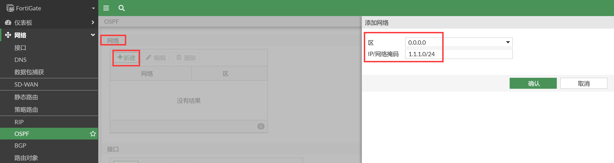

   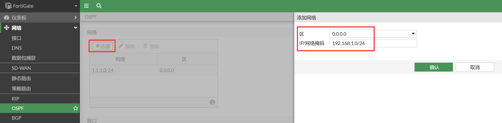

   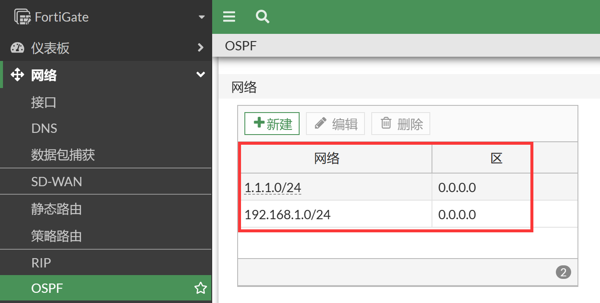

8. 添加OSPF接口（可选，可以自定义OSPF的协商参数），在接口部分点击新建按钮，配置相关的协商参数。

   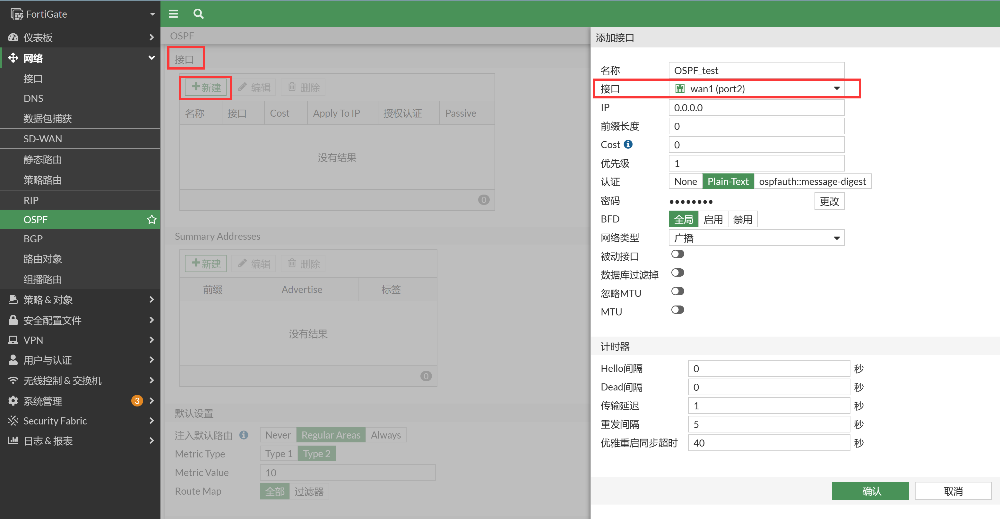

   - 名称： 标识作用
   - 接口：需要编辑的接口
   - 认证： 是否需要对该接口进行OSPF的认证，支持Plain-Text（明文），none（无），几种方式
   - Cost：接口OSPF cost值，用于SPF的计算，值越小代表越可用于优先转发
   - 密码： 输入key的秘钥
   - 计时：
     - Hello间隔： hello包的发送间隔默认为10秒，根据需要进行修改，对OSPf邻居协商时，该参数需要相同
     - Dead间隔： 默认为40秒，根据需要进行修改，对OSPf邻居协商时，该参数需要相同

9. 对应的CLI。

   ```
   config router ospf
       set default-information-originate enable
       set router-id 1.1.1.1
       config area
           edit 0.0.0.0
           next
       end
       config network
           edit 1
               set prefix 1.1.1.0 255.255.255.0
           next
           edit 2
               set prefix 192.168.1.0 255.255.255.0
           next
       end
       config redistribute "connected"
           set status enable
       end
       config redistribute "static"
       end
       config redistribute "rip"
       end
       config redistribute "bgp"
       end
       config redistribute "isis"
       end
   end
   
   ```

10. 配置路由器。

    ```
    配置接口IP：
    interface e 0/1
    ip address 1.1.1.2 255.255.255.0
    interface e 0/2
    ip address 192.168.2.1 255.255.255.0
    
    配置OSPF：    
    router ospf 10
    network 1.1.1.0 0.0.0.255 area 0
    network 192.168.2.0 0.0.0.255 area 0    //该条目也可以采用直连分发的方式发布
    ```

## 结果验证

1. 查看FortiGate的路由表，可以看到FortiGate学到了路由器发布的路由192.168.2.0/24。

   ```
   FortiGate # get router info routing-table all
   Codes: K - kernel, C - connected, S - static, R - RIP, B - BGP
          O - OSPF, IA - OSPF inter area
          N1 - OSPF NSSA external type 1, N2 - OSPF NSSA external type 2
          E1 - OSPF external type 1, E2 - OSPF external type 2
          i - IS-IS, L1 - IS-IS level-1, L2 - IS-IS level-2, ia - IS-IS inter area
          * - candidate default
   
   Routing table for VRF=0
   S*      0.0.0.0/0 [10/0] via 192.168.118.1, port2, [1/0]
   C       1.1.1.0/24 is directly connected, port3
   C       192.168.1.0/24 is directly connected, port4
   O       192.168.2.0/24 [110/11] via 1.1.1.2, port3, 00:00:33
   C       192.168.100.0/24 is directly connected, port1
   C       192.168.118.0/24 is directly connected, port2
   ```

2. 查看路由器的路由表，可以看到路由器学到了FortiGate重发布的两个直连网段192.168.1.0/24、192.168.118.0/24，以及FortiGate注入的默认路由。

   ```
   Router#show ip route
   Codes: L - local, C - connected, S - static, R - RIP, M - mobile, B - BGP
          D - EIGRP, EX - EIGRP external, O - OSPF, IA - OSPF inter area 
          N1 - OSPF NSSA external type 1, N2 - OSPF NSSA external type 2
          E1 - OSPF external type 1, E2 - OSPF external type 2
          i - IS-IS, su - IS-IS summary, L1 - IS-IS level-1, L2 - IS-IS level-2
          ia - IS-IS inter area, * - candidate default, U - per-user static route
          o - ODR, P - periodic downloaded static route, H - NHRP, l - LISP
          a - application route
          + - replicated route, % - next hop override, p - overrides from PfR
   
   Gateway of last resort is 1.1.1.1 to network 0.0.0.0
   
   O*E2  0.0.0.0/0 [110/10] via 1.1.1.1, 00:00:49, Ethernet0/1
         1.0.0.0/8 is variably subnetted, 2 subnets, 2 masks
   C        1.1.1.0/24 is directly connected, Ethernet0/1
   L        1.1.1.2/32 is directly connected, Ethernet0/1
   O     192.168.1.0/24 [110/11] via 1.1.1.1, 00:00:49, Ethernet0/1
         192.168.2.0/24 is variably subnetted, 2 subnets, 2 masks
   C        192.168.2.0/24 is directly connected, Ethernet0/2
   L        192.168.2.1/32 is directly connected, Ethernet0/2
   O E2  192.168.118.0/24 [110/10] via 1.1.1.1, 00:00:49, Ethernet0/1
   ```
