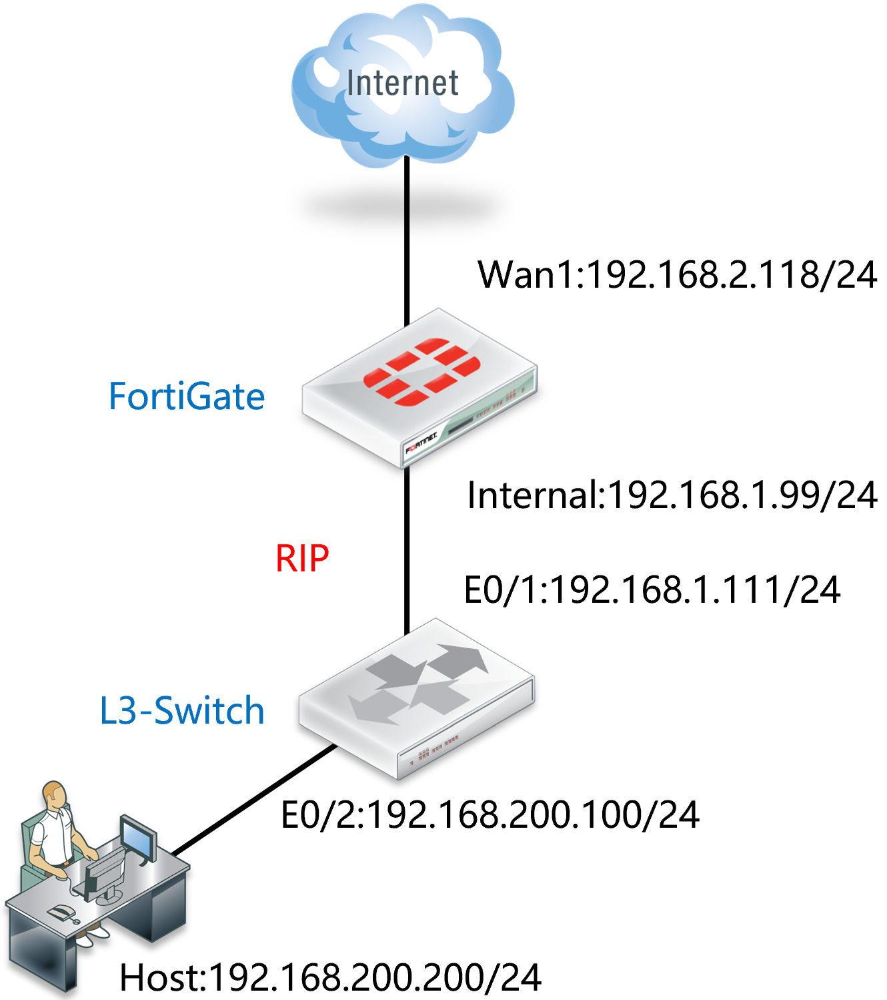
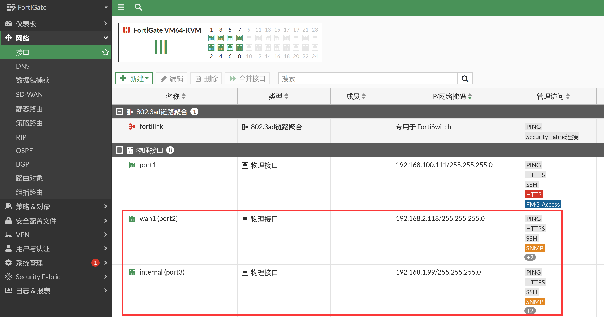
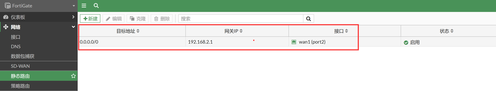
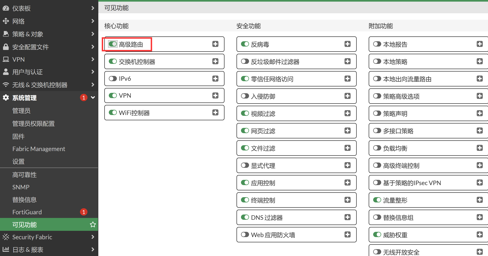
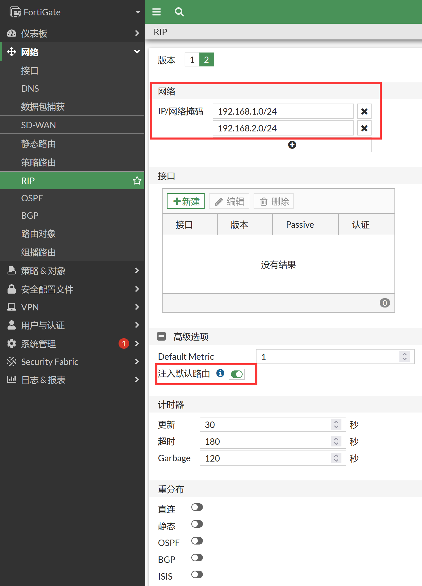

# RIP

## 应用场景

1. 当网络路由设备较多，且不超过16个，为避免写大量静态路由，且路由可自动学习，可在FortiGate上配置RIP路由协议，让FortiGate也能动态学习到其他网络的路由，且能自动老化更新。
2. 若网络中路由设备超过16个，建议使用OSPF，它的路由学习更新速度更快，更适合16个路由设备以上的网络。
3. 当网络中路由设备较少，建议使用静态路由即可，维护简单，且对路由器要求不高，因为路由器都支持静态路由，而普通小路由一般不支持RIP协议。

## 组网需求

1. 内网三层交换机和出口FortiGate间通过动态路由RIP互相通告路由，实现内网用户正常上网。
2. FortiGate手动配置默认路由，并将其重发布引入RIP，三层交换机与FortiGate之间通过RIP互相学习路由，实现内网用户正常上网。

## 网络拓扑



## 配置要点

- 配置接口地址
- 配置防火墙
- 配置路由器

## 配置步骤

1. 配置FortiGate接口IP。

   

2. 配置默认路由。

   

3. 配置RIP，需要进入系统管理→可见功能中打开高级路由。

   

4. 进入网络→RIP，配置基本信息：选择版本2，添加RIP网络，启用产生缺省路由，向邻居（路由器）发送缺省路由（路由分发：是否对其他协议的路由进行分发）。

   

   ```
   config router rip
       set default-information-originate enable
       config network
           edit 1
               set prefix 192.168.1.0 255.255.255.0
           next
           edit 2
               set prefix 192.168.2.0 255.255.255.0
           next
       end
   end
   ```

5. 配置路由器。

   ```
   interface Ethernet0/1
    ip address 192.168.1.111 255.255.255.0
    duplex auto
   !
   interface Ethernet0/2
    ip address 192.168.200.100 255.255.255.0
   !
   router rip
   version 2
   network 192.168.1.0
   network 192.168.10.0
   no auto-summary
   ```

## 结果验证

1. 查看FortiGate的路由表。

   ```
   FortiGate # get router info routing-table all
   Codes: K - kernel, C - connected, S - static, R - RIP, B - BGP
          O - OSPF, IA - OSPF inter area
          N1 - OSPF NSSA external type 1, N2 - OSPF NSSA external type 2
          E1 - OSPF external type 1, E2 - OSPF external type 2
          i - IS-IS, L1 - IS-IS level-1, L2 - IS-IS level-2, ia - IS-IS inter area
          * - candidate default
   Routing table for VRF=0
   S*      0.0.0.0/0 [5/0] via 192.168.100.99, port1, [1/0]
   C       192.168.1.0/24 is directly connected, port3
   C       192.168.2.0/24 is directly connected, port2
   C       192.168.100.0/24 is directly connected, port1
   R       192.168.200.0/24 [120/2] via 192.168.1.111, port3, 00:01:18
   
   FortiGate # get router info rip database 
   Codes: R - RIP, Rc - RIP connected, Rs - RIP static, K - Kernel,
          C - Connected, S - Static, O - OSPF, I - IS-IS, B - BGP
      Network            Next Hop         Metric From            If     Time
   Rs 0.0.0.0/0                                1                  --   
   Rc 192.168.1.0/24                           1                 port3 
   Rc 192.168.2.0/24                           1                 port2 
   R  192.168.200.0/24   192.168.1.111         2 192.168.1.111   port3  02:18
   ```

2. 查看思科路由器的路由表。

   ```
   Router#show ip route
   Codes: L - local, C - connected, S - static, R - RIP, M - mobile, B - BGP
          D - EIGRP, EX - EIGRP external, O - OSPF, IA - OSPF inter area 
          N1 - OSPF NSSA external type 1, N2 - OSPF NSSA external type 2
          E1 - OSPF external type 1, E2 - OSPF external type 2
          i - IS-IS, su - IS-IS summary, L1 - IS-IS level-1, L2 - IS-IS level-2
          ia - IS-IS inter area, * - candidate default, U - per-user static route
          o - ODR, P - periodic downloaded static route, H - NHRP, l - LISP
          a - application route
          + - replicated route, % - next hop override, p - overrides from PfR
   
   Gateway of last resort is 192.168.1.99 to network 0.0.0.0
   
   R*    0.0.0.0/0 [120/1] via 192.168.1.99, 00:00:07, Ethernet0/1
         192.168.1.0/24 is variably subnetted, 2 subnets, 2 masks
   C        192.168.1.0/24 is directly connected, Ethernet0/1
   L        192.168.1.111/32 is directly connected, Ethernet0/1
   R     192.168.2.0/24 [120/1] via 192.168.1.99, 00:00:07, Ethernet0/1
         192.168.200.0/24 is variably subnetted, 2 subnets, 2 masks
   C        192.168.200.0/24 is directly connected, Ethernet0/2
   L        192.168.200.100/32 is directly connected, Ethernet0/2
   ```

   
