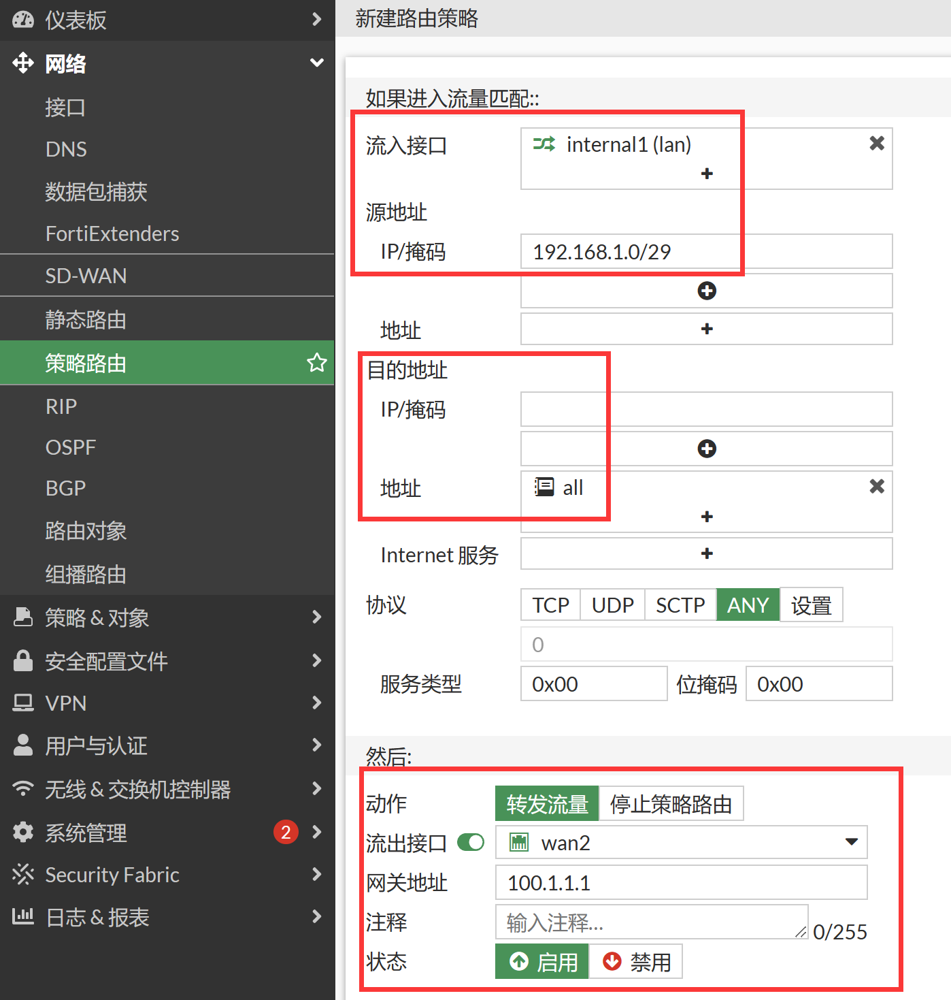

# 策略路由

## 基本概念

1. 静态动态路由等，都属于目的路由，即根据目的地址进行选路。
2. 策略路由则可以根据原地址，协议类型，流控标签，目的地址等多个参数进行选路。
3. 策略路由优于静态路由，被先执行。

## 应用示例

1. 场景参考[双线路不同运营商上网配置](..\策略与对象\多线路上网配置\双线路不同运营商上网配置.md)。

2. 强制192.168.1.0/29的地址，从wan2口访问互联网。

3. 进入系统管理→可见功能，开启高级路由功能。

   

4. 进入网络→策略路由，新建策略路由，强制192.168.1.0/29的地址，从wan2口访问互联网，该策略路由定义所有从internal1进入的，源地址是192.168.1.0 255.255.255.248，目的地址是0.0.0.0 0.0.0.0的数据包，都会被强制由wan2转发，转发时下一条的网关地址为100.1.1.1。

   

   - 协议：协议类型，ANY为所有任何协议，可以指定6 tcp,17 udp,132等
   - 流入接口：流量进入接口
   - 源地址掩码： 数据包的源地址
   - 目的地址掩码：数据包的目的地址
   - 目的端口：目的端口，默认为所有。从1-65536
   - 强制流量到：
      - 流出接口： 数据包的流出接口
      - 网关地址： 流出接口的下一条网关地址
