# 路由介绍

## 路由转发表

1. FIB (Forwarding Information Base)，包含所有已知的本地或非本地路由，从路由表载入，由内核访问。

2. 内核转发数据时看diagnose ip route list，而非get router info routing-table all。

   ```
   diagnose ip route list
   ```

## 路由表

1. 路由表包括最具体的路由条目、最长掩码匹配原则、路由的管理距离、度量值等决定哪个协议产生的哪条路由被内核采用。

   ```
   get router info routing-table all
   ```

2. 路由表中的相关元素。

   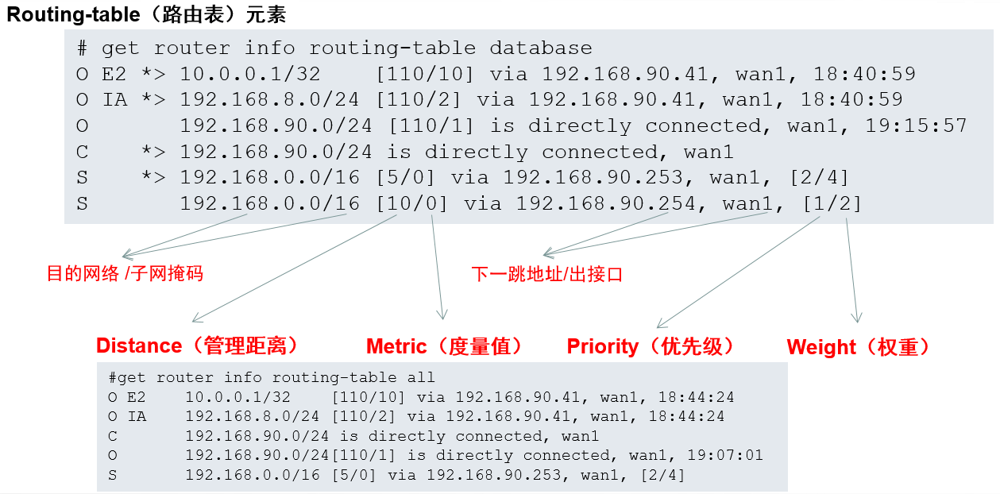

   - Distance（管理距离）

     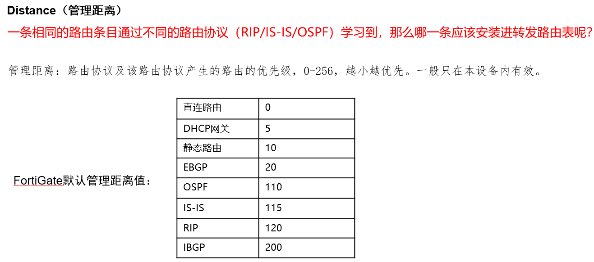

   - Metric（度量值）

     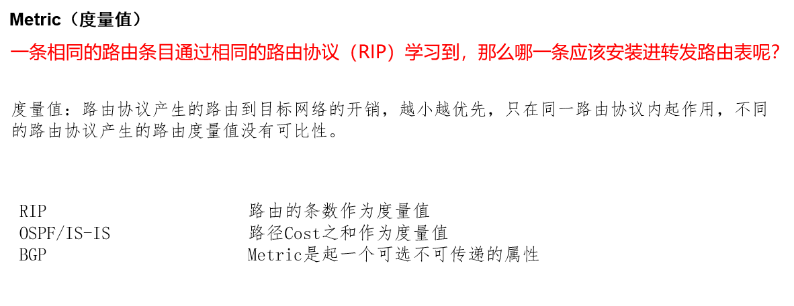

   - Priority（优先级）

     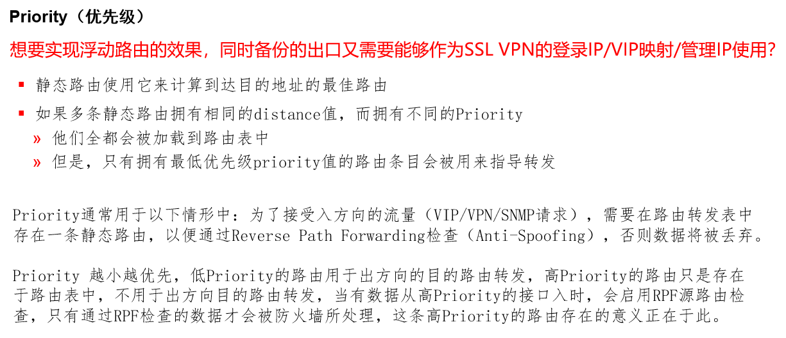

## 路由选路

1. 情景1：相同的distance，相同的priority。

   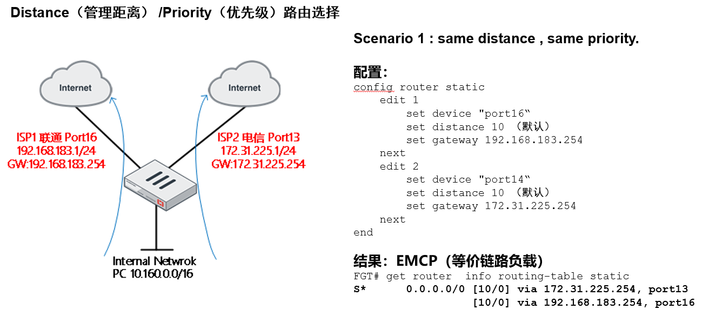

2. 情景2：不同的distance，相同的priority。

   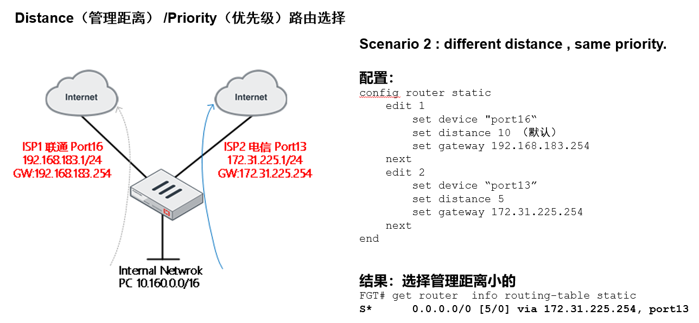

3. 情景3：相同的distance，不同的priority。

   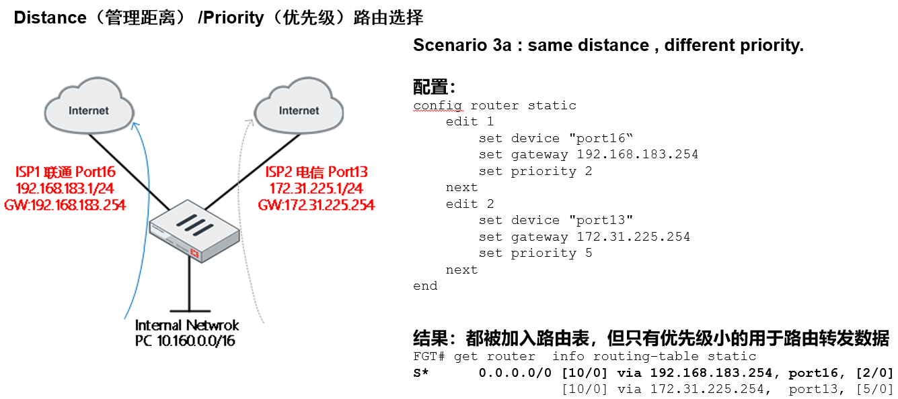

   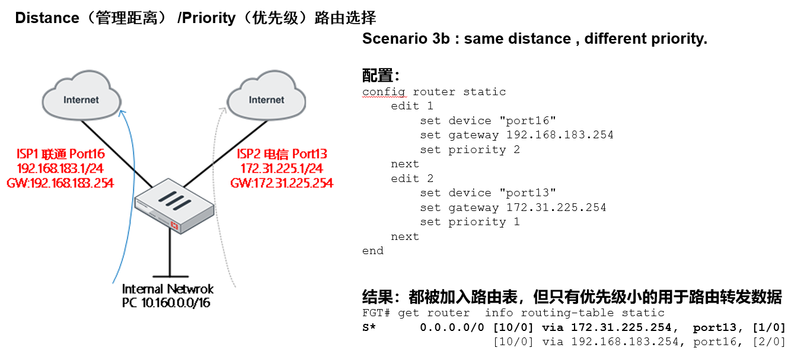

4. Weight（权重）对选路的影响。

   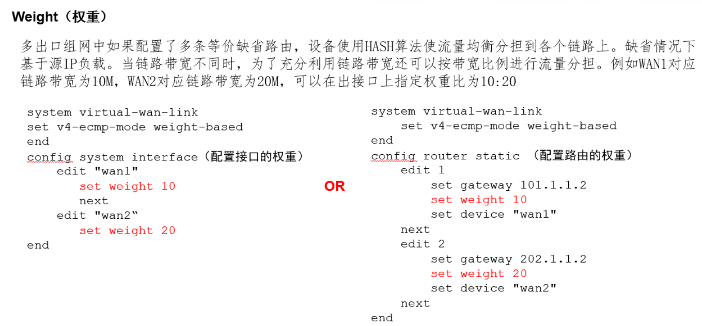

5. 总结：

   - 策略路由比路由表优先
   - 如果接口down则没有相关的路由（包括没有直连路由）
   - 目标网段不同，都优选
   - 目标网段相同，子网掩码不同时，都优选:转发时最长掩码匹配目标网段、子网掩码都相同时，最低管理距离优先
   - 目标网段、子网掩码、管理距离都相同时，最低度量值优先目标网段、子网掩码、管理距离、度量值都相同时，视具体协议而定，一般可形成等开销负载分担路由
## RPF（Reverse Path Forwarding，反向路径转发）

RPF的作用：
- 阻止IP欺骗攻击

   - 测试DDoS不成功的原因（攻击源IP为随机IP）

- 校验所有包的源地址

   - 和接口相关的路由比较IP地址

   - 丢弃那些源IP没有返回路由的包

      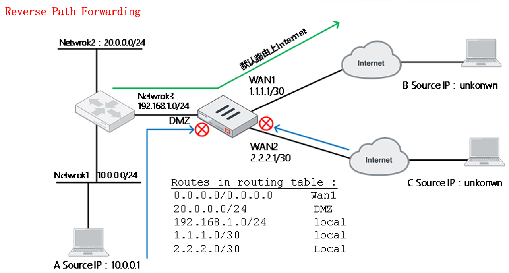

- 如果源IP地址的返回路径与包来的路径不匹配，则这个包被丢弃

   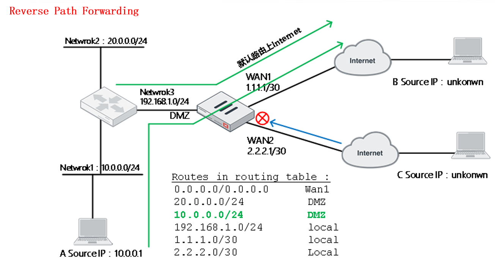

   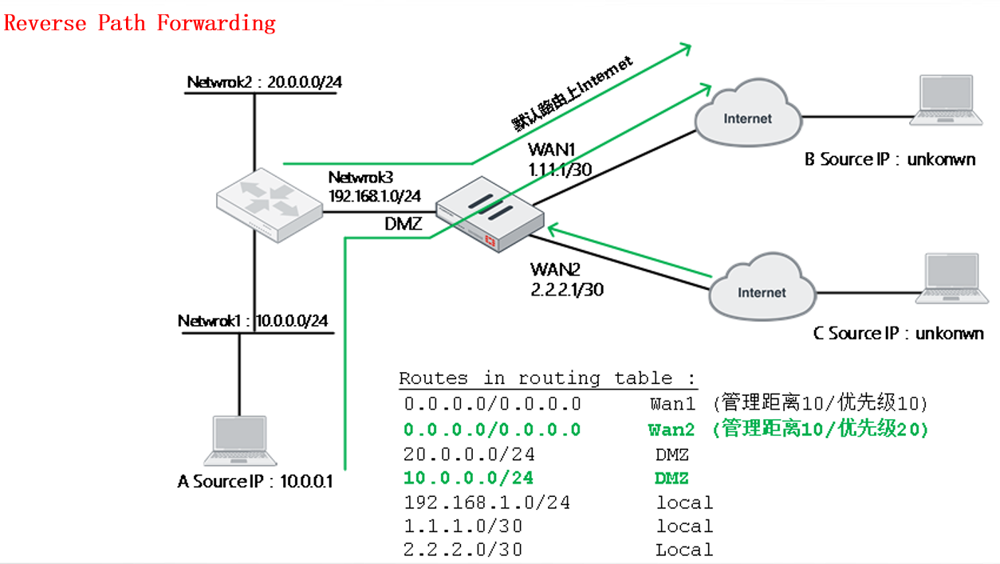

- RPF只检查会话的第一个包

   - 来去路径相同时，不检查回应包（也没有必要）
   - 异步情况下，对回包也执行检查

## 源进源出

1. 源进源出介绍：

   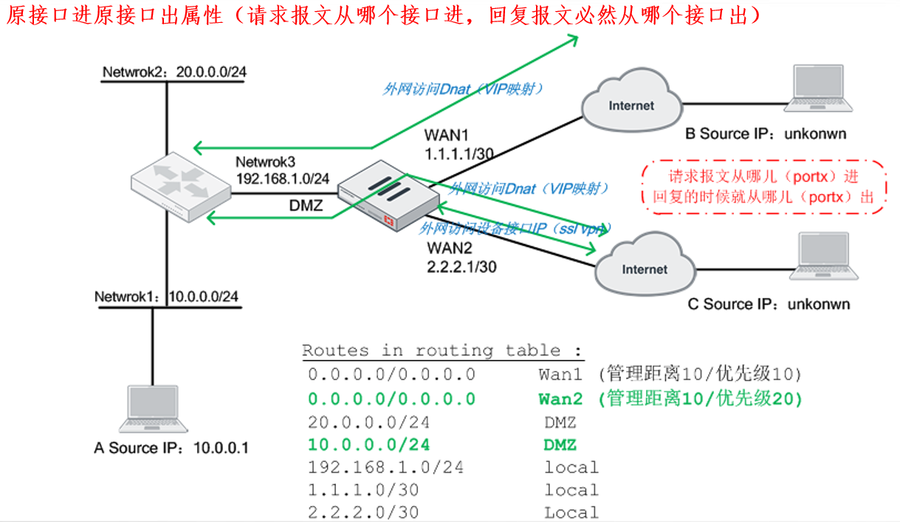

2. 如何关闭RPF（同时源进源出特性跟随关闭）：

   - 开启异步路由（一般情况下不建议，会话安全性检查将降低）：
   
     ```
     config system settings
     	set asymroute enable    //default = disable
     end
     ```
   
   - 基于接口关闭RPF：
   
     ```
     config system interface
         edit <interface>
             set src-check disable
     end
     ```

