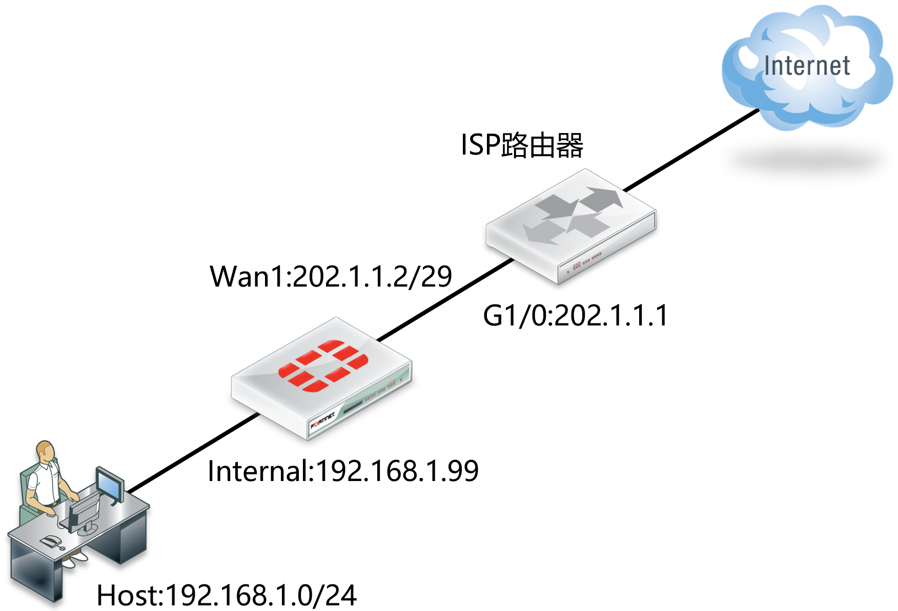
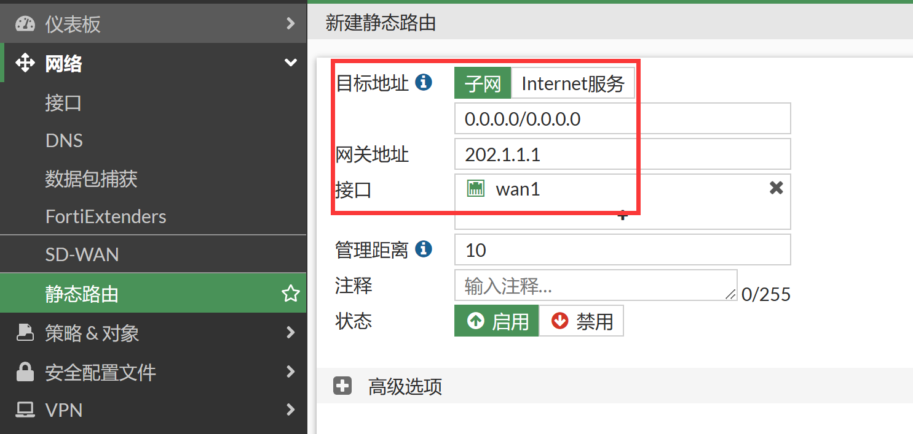
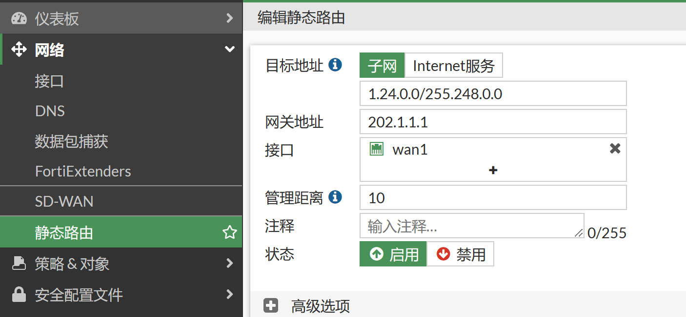
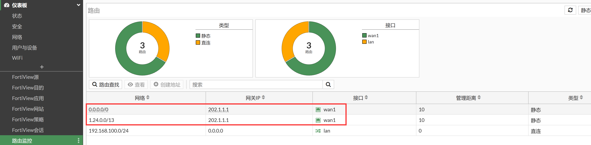

# 静态路由

## 组网需求

静态路由是由系统管理员，根据网络的结构，在防火墙上手工添加路由条目。对于防火墙设备来说，静态路由是最基本的方式，也是最常用的添加路由的方式。

## 网络拓扑



防火墙外网口wan1 ip地址为202.1.1.2， 对端ISP路由器G1/0口地址为202.1.1.1。

## 配置步骤

1. 配置相关接口IP（略）。

2. 进入网络→静态路由，点击 新建，按如下方式创建路由表。

   

   

   - 目的的IP/子网掩码：   由于是默认网关，使用默认的0.0.0.0/0.0.0.0即可
   - 设备： 该路由所关联的接口，wan1口，必须正确填写，否则该路由无法工作
   - 网关： 下一跳ip地址， 即wan1口对端运营商设备接口的ip地址
   - 路径长度：默认10。 对于相同的路由条目，管理距离短的会被放入路由表。如果管理距离相同，则都会被放入路由表
   - 优先级：默认0.管理距离相同的两条路由，防火墙优先使用优先级参数较低的路由工作。

3. 对应CLI。

   ```
   FortiGate # config router static
   FortiGate (static) # edit 1
   FortiGate (1) # set gateway 202.1.1.1    //本条目没有定义dst目的网络，则默认为为0.0.0.0/0.0.0.0
   FortiGate (1) # set device wan1
   FortiGate (1) # next
   
   FortiGate (static) # edit 2
   FortiGate (2) # set dst 1.24.0.0 255.248.0.0
   FortiGate (2) # set gateway 202.1.1.1
   FortiGate (2) # set device wan1
   FortiGate (2) # end
   ```

## 结果验证

1. 通过图形页面查看路由表，进入仪表盘，添加路由监控组件。

   

2. 或通过命令行查看该路由是否生效：get router info routing-table static。

   ```
   FortiGate # get router info routing-table all
   Codes: K - kernel, C - connected, S - static, R - RIP, B - BGP
          O - OSPF, IA - OSPF inter area
          N1 - OSPF NSSA external type 1, N2 - OSPF NSSA external type 2
          E1 - OSPF external type 1, E2 - OSPF external type 2
          i - IS-IS, L1 - IS-IS level-1, L2 - IS-IS level-2, ia - IS-IS inter area
          * - candidate default
   
   Routing table for VRF=0
   S*      0.0.0.0/0 [10/0] via 202.1.1.1, wan1, [1/0]
   S       1.24.0.0/13 [10/0] via 202.1.1.1, wan1, [1/0]
   C       192.168.100.0/24 is directly connected, lan
   ```

3. 通过ping 202.1.1.1，确认链路正常。
