# FortiGate通用多运营商路由导入脚本

## 运营商地址列表

电信、网通的路由表是不断在更新的，可以通过https://ispip.clang.cn/ 查看运营商的地址列表

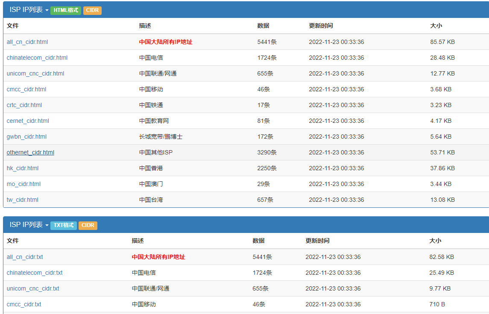

如点击“unicom_cnc_cidr.html”，就可以看到联通的地址列表

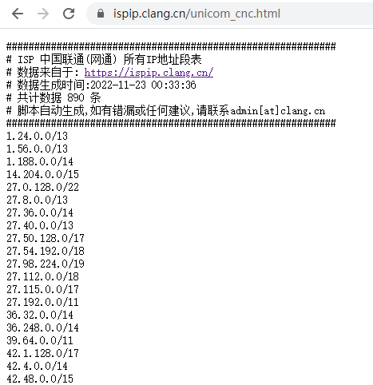

## 生成运营商路由脚本

根据运营商地址列表，在FortiGate中生成对应的运营商路由。可以python，NimbleText等工具生成，这里使用NimbleText，其官网链接：http://nimbletext.com/

1. 通过NimbleText生成地址对象条目，这里截取联通地址列表的一部分做示范，其他的同理。

   在NimbleText选择“Tools”，点击“options...”，取消勾选“Output a new line after each row”

   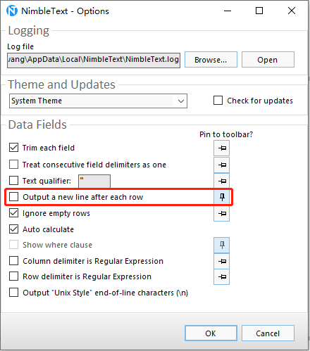

   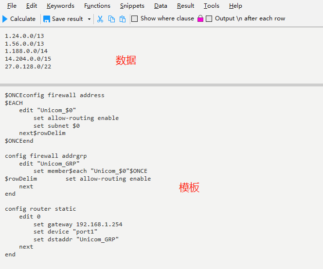

   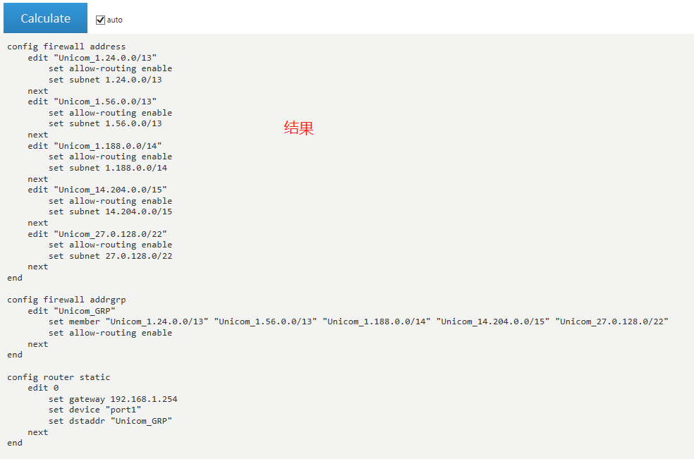

   模板中的脚本，其中config router static下的gateway和device需要根据现场的环境修改

   ```
   $ONCEconfig firewall address
   $EACH
       edit "Unicom_$0"
           set allow-routing enable
           set subnet $0
       next$rowDelim
   $ONCEend
   
   config firewall addrgrp
       edit "Unicom_GRP"
           set member$each "Unicom_$0"$ONCE
   $rowDelim        set allow-routing enable
       next
   end
   
   config router static
       edit 0
           set gateway 192.168.1.254       #改为现场环境使用的网关ip
           set device "port1"              #改为现场环境使用的接口
           set dstaddr "Unicom_GRP"
       next
   end
   ```
   
2. 将生成的结果保存在notepad++中，然后点击“编码”-->“使用UTF-8编码“并保存

   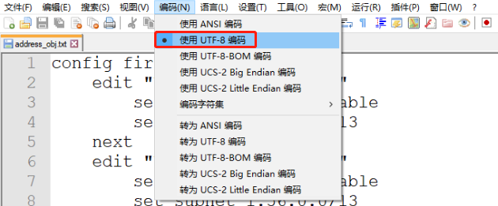

   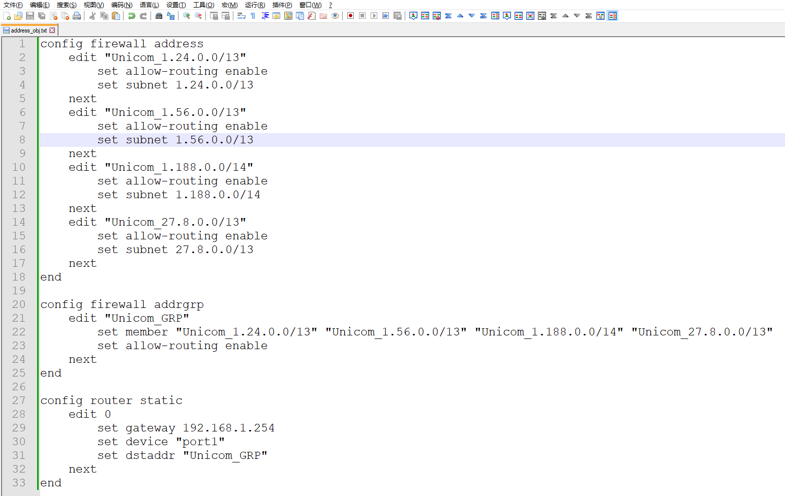

3. 点击FortiGate右上角账号旁边的下拉箭头，选择“配置”-->“脚本”，点击“运行脚本”

   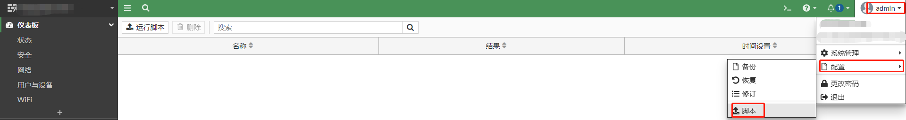

   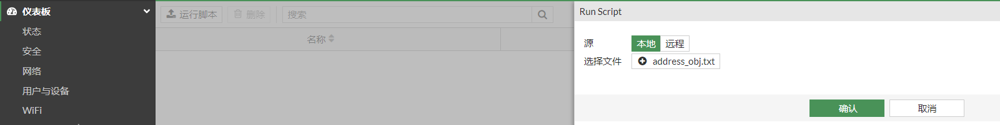

4. 脚本上传成功后会显示“成功”的字样

   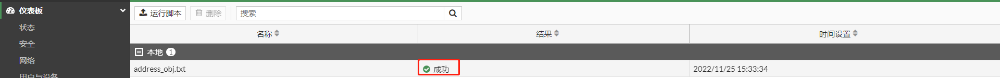

5. 在FortiGate地址对象界面查看刚刚上传的地址对象，地址对象组，路由

   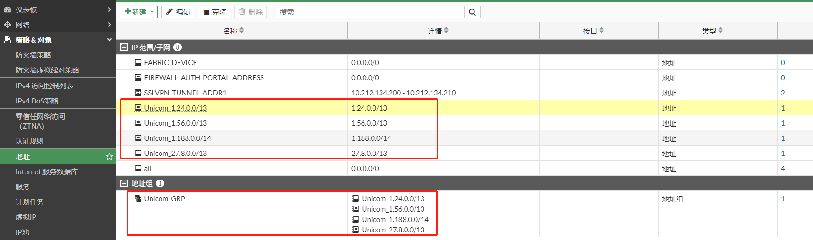

   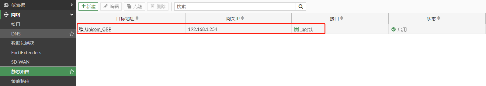
