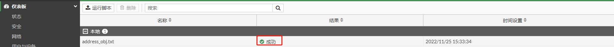

# 命令行脚本批量转换工具说明

## 说明

通常使用NimbleText工具生成相应的脚本，然后使用Notepad++保存脚本。

NimbleText：用于批量生成命令行脚本。官网链接：http://nimbletext.com/

Notepad++：文本编辑器，保存配置脚本，保存成.txt格式，编码为“UTF-8编码”。官网链接：https://notepad-plus-plus.org/

## NimbleText的脚本编辑举例

NimbleText帮助文档：

https://nimbletext.com/Help/Keywords

https://nimbletext.com/help

NimbleText的界面分成三个部分：数据，模板，结果，NimbleText就是将数据和模板结合生成对应的结果。


1. 批量生成地址对象

   ```
   地址列表
   1.24.0.0/13
   1.56.0.0/13
   1.188.0.0/14
   14.204.0.0/15
   27.0.128.0/22
   
   FortiGate地址对象配置示例
   config firewall address
       edit "1.1.1.0/24"
           set subnet 1.1.1.0/24
       next
   end
   
   根据地址对象命令分析，config firewall address和end不需要重复执行，对于edit和set subnet需要根据地址列表的变化而重复。
   $ONCEconfig firewall address
   $EACH
       edit "$0"
           set subnet $0
       next
   $ONCEend
   
   $ONCE，$EACH，$0都是NimbleText的关键字
   $ONCE:任何在'$ONCE'关键字之后的文本将只输出一次，不管有多少行，到'$EACH'关键字或者到文件末尾为止。
   $EACH:在'$EACH'关键字之后的任何文本将为每行输出一次（默认会换行），不管有多少行，到'$ONCE'关键字或者到文件末尾为止。
   可以随意交错任意多的“$ONCE”和“$EACH”。
   $0，$1:$0是第1列的数据，$1是第2列的数据，依次类推。
   
   ```

   

2.批量生成地址对象，并将其加入地址对象组

```
地址列表
1.24.0.0/13
1.56.0.0/13
1.188.0.0/14
14.204.0.0/15
27.0.128.0/22

FortiGate地址对象,地址对象组配置示例
config firewall address
    edit "1.1.1.0/24"
        set subnet 1.1.1.0/24
    next
    edit "1.1.2.0/24"
        set subnet 1.1.2.0/24
    next
end
config firewall addrgrp
    edit "group1"
        set member "1.1.1.0/24" "1.1.2.0/24"
    next
end
```

按照示例1的方式，NimbleText输出如下：


在地址对象配置中edit "$0"和set subnet $0循环第1列数据时，需要换行；在地址对象组set member$EACH $0 循环第1列的数据时，不需要换行。因此需要解决$EACH关键自动换行的问题。

修改$EACH关键字的输出不自动换行，选择”Tools“-->“Options...”，取消勾选“Output a new line after each row”


$rowDelim：行分隔符，这里利用这个关键字来换行。选择“Tools”-->“Command-line helper”，点击“Options”可以看出行分隔符是\r\n。


NimbleText修改后模板脚本如下：

```
$ONCEconfig firewall address
$EACH
    edit "$0"
        set subnet $0
    next$rowDelim
$ONCEend

config firewall addrgrp
    edit "group1"
        set member$EACH "$0"
$ONCE$rowDelim    next
end
```


## Notepad++保存脚本并导入

将NimbleText的输出保存在notepadd++中，选择“编码”-->“使用UTF-8编码”，并保存。


点击右上角下拉箭头，选择”配置“-->”脚本“，点击”运行脚本“，上传address_obj.txt，脚本上传成功后会显示“成功”的字样。




## 上传脚本失败排查

脚本上传显示“失败”的字样，即该脚本有问题。


在上传时，通过ssh或者web console登录FortiGate命令行，可以通过debug命令查看具体是哪一行有问题。

```
# diagnose debug  cli 8
# diagnose debug  enable 
在diagnose debug cli 8的输出中，只有值为0才是成功的。

cmd=/tmp/monitor_upload_nRf481
0: config firewall address
0:     edit "1.24.0.0/13"
0:         set subnet 1.24.0.0/13
0:     next
0:     edit "1.56.0.0/13"
0:         set subnet 1.56.0.0/13
0:     next
0:     edit "1.188.0.0/14"
0:         set subnet 1.188.0.0/14
0:     next
0:     edit "14.204.0.0/15"
0:         set subnet 14.204.0.0/15
0:     next
0:     edit "27.0.128.0/22"
-160:         set subnet 27.0.128.0     #从这里可以看出这个地址没有掩码，修改后就能够正常上传了
1:     next
0: end
0: 
0: config firewall addrgrp
0:     edit "group1"
-3:         set member "1.24.0.0/13" "1.56.0.0/13" "1.188.0.0/14" "14.204.0.0/15" "27.0.128.0/22"
1:     next
0: end
0: 
```
